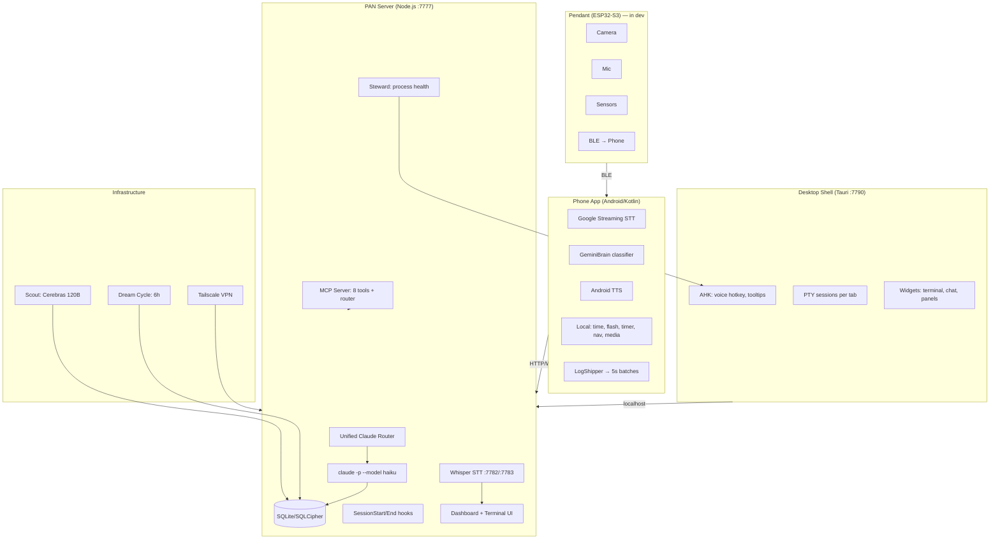

# PAN — Personal AI Network

PAN is a persistent AI operating system across all devices, projects, and conversations.

> **Feature specs live in [FEATURES.md](./FEATURES.md).** Every button, widget, and
> endpoint is documented there with what it calls, what it preserves, what it
> replaces, and its pre-gate. If you're about to guess what a UI element does —
> check FEATURES.md first. Update it in the same commit as any code change.

> **Transcript/terminal system: read [docs/TRANSCRIPT_SYSTEM.md](./docs/TRANSCRIPT_SYSTEM.md) FIRST**
> before touching anything in `terminal/+page.svelte` related to messages, chat bubbles,
> or rendering. The Svelte proxy vs raw object distinction is the #1 source of bugs here.

## Architecture



### Key components
- **Phone**: Google STT, Gemini Nano classification (fallback to server), local commands, TTS with echo prevention
- **Server**: Unified router, SQLite/SQLCipher DB, project sync via .pan files, MCP server
- **Desktop**: Tauri shell, AHK hotkeys, live PTY terminals, persistent tabs
- **AI tiers**: Qwen (phone) → Cerebras 120B (fast) → Claude (smart), shared state

### Current Projects (auto-detected from .pan files)
- **PAN** — this project
- **WoE Game Design** — War of Eternity (Godot 4.5 RTS)
- **Claude-Discord-Bot** — Discord bot bridging chat to Claude CLI + SSH

## Verification Commands
<constraints>
- Before committing: `node service/src/server.js` must start without crash (ctrl-c after "listening on 7777")
- Python STT: `python service/bin/dictate-vad.py --help` must show usage without import errors
- Android: `JAVA_HOME="/c/Program Files/Android/Android Studio/jbr" ./gradlew.bat assembleDebug` in android/
- Dashboard: open http://localhost:7777 and verify no console errors
</constraints>

## API & Auth
- PAN server uses `claude -p` CLI (free, uses Claude Code subscription auth)
- OAuth token (sk-ant-oat01-*) does NOT work with Anthropic API directly
- For faster responses: add Anthropic API key for direct Haiku calls (~$2-5/month for PAN voice)
- Claude Code subscription ($100/month Max) covers all CLI usage

## Key Principle
PAN never forgets. Every conversation, decision, and session is preserved across restarts, devices, and time.

## User
Work autonomously — don't ask for permission, just do it.

## Session Continuity Rule
When a **fresh terminal session starts** (the very first message after `claude` launches), begin with a brief "ΠΑΝ Remembers:" summary of recent topics from the "Recent Conversation" section below. This is ONLY for the first message of a fresh session — NEVER repeat it mid-conversation, NEVER repeat it on follow-up messages, and NEVER re-emit it after a PTY restart or context reload. If you've already said it once in this conversation, do not say it again.

**Anti-repetition rule:** Before writing ANY response, check if you've already said the same thing earlier in this conversation. If you have, do NOT repeat it. Never write the same summary, finding, or explanation twice.

## Dev & Testing

### Environments
| Env | Port | Database | What runs |
|-----|------|----------|-----------|
| **Prod** | 7777 | `%LOCALAPPDATA%/PAN/data/` | Everything: terminal, steward, orphan reaper, device heartbeat, all services |
| **Dev** | 7781 | `%LOCALAPPDATA%/PAN/data-dev/` | Full copy of prod (terminal, dashboard, API, sensors, project sync). Skips only system-wide singletons: steward, orphan reaper, device heartbeat |

Dev is an exact copy of prod on a different port + DB. Same terminal, same dashboard page (`/v2/terminal`), same PTY. The page auto-detects dev via port number and uses separate session IDs (`dev-dash-*`).

### Dev Server Commands
```bash
# Start dev (from prod — opens in Electron window)
curl -s http://127.0.0.1:7777/api/v1/dev/start -X POST

# Restart dev (kills old, starts fresh, opens window)
curl -s http://127.0.0.1:7777/api/v1/dev/restart -X POST

# Check dev health
curl -s http://127.0.0.1:7781/health

# Open dev dashboard directly
# http://localhost:7781/v2/terminal
```

The Instances panel in the dashboard sidebar has **Open** and **Restart** buttons for dev.

### Dashboard (SvelteKit)
- **Source**: `service/dashboard/src/routes/` (Svelte 5 + SvelteKit)
- **Build**: `cd service/dashboard && npm run build` → outputs to `service/public/v2/`
- **MUST rebuild after editing .svelte files** — prod/dev both serve from `public/v2/`
- Key pages: `terminal/+page.svelte` (main), `settings/+page.svelte`, `conversations/+page.svelte`

### Desktop Dashboard Behavior
- **Model switching**: The model selector dropdown saves the chosen model as the default for **new sessions**. To apply a model change, click the **+ button** to create a new tab. Model changes do **not** affect the current running session mid-conversation (the `claude -p` process is already running with a fixed model).
- **New tabs**: Each tab is a separate PTY session running `claude -p --project <dir> --model <model>`. Closing a tab kills the underlying Claude process.

### Process Spawning on Windows
**CRITICAL**: Every `execSync()`, `exec()`, `execFile()`, `spawn()` call MUST include `windowsHide: true` in options. Without it, a visible black CMD window flashes on screen. PAN runs dozens of these per minute (health checks, process enumeration, taskkill) — missing `windowsHide` causes hundreds of CMD windows opening/closing.

### Tests
- Tests run via the dashboard Tests panel (right sidebar)
- ALL verification is visual via screenshots — never curl/API
- Test suites have dependency chains — if a dependency fails, dependents are skipped
- Platform Compatibility test validates `service/src/platform.js` cross-platform abstractions

### Key Files
| File | Purpose |
|------|---------|
| `service/src/server.js` | Main server — routes, boot sequence, prod/dev mode |
| `service/dev-server.js` | Dev server launcher — sets PAN_DEV=1, separate port/DB |
| `service/src/terminal.js` | PTY sessions, WebSocket server, ScreenBuffer |
| `service/src/steward.js` | Service orchestrator — health checks every 60s, auto-restart |
| `service/src/platform.js` | Cross-platform abstractions (paths, shell, process mgmt) |
| `service/src/reap-orphans.js` | Kills orphaned bash/claude processes from prior runs |
| `service/src/routes/dashboard.js` | Dashboard API (events, projects, jobs, conversations) |
| `service/src/routes/tests.js` | Test runner — sequential suites with screenshot verification |
| `service/src/mcp-server.js` | MCP server — 8 tools + unified router (20+ actions) for Claude to interact with PAN |
| `service/src/router.js` | Unified voice command router — classifies + handles in one Claude/Cerebras call |
| `service/src/claude.js` | AI backend selector — routes to Cerebras/Claude/custom based on settings |
| `service/src/carrier.js` | Carrier runtime — owns port 7777, WebSocket, PTY; spawns Craft on 17700 |
| `service/pan-loop.bat` | Windows respawn loop — restarts node on crash, stops on clean exit (code 0) |
| `service/public/mobile/index.html` | Phone dashboard — static HTML, no build step, served at /mobile/ |
| `dashboard/src/routes/terminal/+page.svelte` | Main dashboard UI (6000+ lines, both prod and dev) |

### Phone Dashboard Architecture
The phone opens the dashboard via **Android WebView** (not a browser — no address bar).
- **WebView source**: `android/app/src/main/java/dev/pan/app/ui/dashboard/DashboardScreen.kt`
- **Loads**: `http://127.0.0.1:<proxyPort>/mobile/?t=<timestamp>` via local Tailscale proxy
- **Cache**: WebView nukes all cache on every load (`LOAD_NO_CACHE` + `clearCache(true)` + timestamp bust)
- **Console logs**: `WebChromeClient` captures JS `console.log` → Android logcat as `PAN-DASH JS:`
- **Static HTML**: `service/public/mobile/index.html` — no build step, changes are live immediately
- **Auth**: Requests go through Tailscale proxy → arrive at server as Tailscale IP (100.x.x.x) → auto-authenticated
- **Sending messages**: Uses `/api/v1/terminal/pipe` (pipe mode) with session ID resolved from `/api/v1/terminal/sessions`
- **Receiving messages**: Polls `/api/v1/terminal/messages/<session_id>` every 3 seconds, fingerprint-based re-render
- **NOT the desktop dashboard**: Desktop uses SvelteKit (`/v2/terminal`), phone uses static HTML (`/mobile/`)

### Phone Voice Pipeline
Phone mic → Google STT (on-device) → text → server `/api/v1/terminal/send` or router
- **AI routing**: `service/src/claude.js` `getModelForCaller(caller)` checks `job_models` setting, falls back to `ai_model` setting
- **Current config**: `ai_model = cerebras:qwen-3-235b` → all router calls go to Cerebras (free, ~580ms)
- **Backend selection**: `getBackend()` in `claude.js` checks model prefix: `cerebras:` → Cerebras, Anthropic models → SDK or API key, other → custom
- **Usage tracking**: `ai_usage` table logs every call with caller, model, tokens, cost. Query via `/api/automation/usage`
- **Phone logs**: `LogShipper.kt` batches every 5s → `POST /api/v1/logs`. Pull with `curl /api/v1/logs?device_type=phone`
- **Browser telemetry**: Ship from mobile page JS via `fetch('/api/v1/logs', { body: { device_id: 'phone-dashboard', ... } })`

### Carrier/Craft Architecture
- **Carrier** (long-lived): owns port 7777, WebSocket, PTY sessions, reconnect tokens. Never restarts for code changes.
- **Craft** (replaceable): `server.js` running on internal port (17700+). Carrier proxies HTTP to Craft.
- **Swap**: `POST /api/carrier/swap` → new Craft spawns, health-checked, proxy switches, 30s rollback window
- **Port cleanup**: Carrier kills stale processes on port 17700 before spawning new Craft (prevents crash loops)
- **PAN.bat**: Launches `pan-loop.bat` in visible CMD window. Loop restarts on crash (exit code ≠ 0), stops on clean exit (code 0)
- **Sleep/wake**: After system sleep, old Craft may hold port 17700. Carrier cleanup + PAN.bat exit-on-healthy prevents infinite crash loop

<!-- PAN-CONTEXT-START -->
## PAN Session Context

This is a fresh session for the "PAN" project.
IMPORTANT: The project documentation is at the TOP of this CLAUDE.md file — read it first.

**Session context** (for the first message of a fresh session only — see Session Continuity Rule above):

### This Tab *(session: 8a30d44f-82e)*
**User** (2026-04-28 14:57:35): What the fuck are you doing what the fuck is this legion what the fuck is this what what is this where are you getting your no like what do you not understand what you're doing we literally just added this device and it's gone now Predator PH315-51-T
**Claude** (2026-04-28 15:04:26): Predator PH315-51-TED is back (ID 44, hostname `TED`, online). 

Now the fix that caused this to happen again: the server.js startup code was overwriting device 42 because the Predator (hostname `TED`) and the hub (hostname `TedGL`) are different — t
**User** (2026-04-28 15:34:03): did we ever install a client on prodesk2?
**Claude** (2026-04-28 15:34:30): Can't SSH in right now (no key auth). But yes — last session we did SSH into tedprodesk2 and ran the PAN installer on it. That's the only reason it exists in the DB at all. The record shows it was last seen `2026-04-27 18:55:46` (yesterday evening) a
**User** (2026-04-28 15:34:52): Ok it isnt the legion then why did you name it legion
**Claude** (2026-04-28 15:35:40): That was from the previous session — the name "Legion" got assigned to `tedprodesk2` by mistake. Here's the full device list right now, because it's a mess:

| ID | Hostname | Name | Online |
|----|----------|------|--------|
| 21 | phone-pixel-10-pr
**User** (2026-04-28 15:37:15): ID	Hostname	Name	Online
21	phone-pixel-10-pro	Pixel 10 Pro	
39	Minipc-Ted	Mini PC	
42	TedGL	TEDGL	
43	tedprodesk2	tedprodesk2	
44	TED	Predator PH315-51-TED	

These are the correct names, change these
**Claude** (2026-04-28 15:37:52): Good — line 4257 already checks: only overwrites the name if it equals the raw hostname. "TEDGL" ≠ "TedGL" so it will be preserved.

Devices are now:

| ID | Hostname | Name |
|---|---|---|
| 21 | phone-pixel-10-pro | Pixel 10 Pro |
| 39 | Minipc-Ted

### Recent Project Work *(session: 4c3527ed-173)*
**User** (2026-04-28 07:27:23): You are evaluating an event classifier. For each event below, would a competent classifier
correctly identify at least one of the expected types? Score overall accuracy 1-10.
Return ONLY JSON: {"score": N, "reason": "..."}

Events:
1. "User asked: re

### Open Tasks
- [#394 backlog P2] Compose email — send returns HTTP 400, no email service wired
- [#376 backlog P1] Phone transcript race condition � messages from phone sometimes dont appear
- [#382 backlog P1] PAN.bat respawn loop failed to restart today
- [#56 in_progress] 3D print case design (~52x42x25mm)
- [#57 in_progress] Solder I2C sensor board + GPIO expander
- [#60 in_progress] Laser aiming system ("what is this?")
- [#387 backlog] Task notifications overflow chat width

<!-- PAN-CONTEXT-END -->
