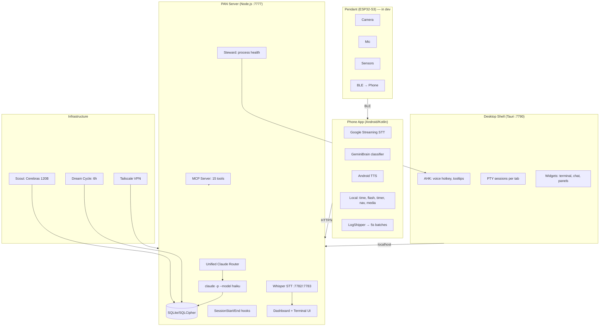

# PAN — Personal AI Network

PAN is a persistent AI operating system across all devices, projects, and conversations.

## Architecture



### Key components
- **Phone**: Google STT, Gemini Nano classification (fallback to server), local commands, TTS with echo prevention
- **Server**: Unified router, SQLite/SQLCipher DB, project sync via .pan files, MCP server
- **Desktop**: Tauri shell, AHK hotkeys, live PTY terminals, persistent tabs
- **AI tiers**: Qwen (phone) → Cerebras 120B (fast) → Claude (smart), shared state

### Current Projects (auto-detected from .pan files)
- **PAN** — this project
- **WoE Game Design** — War of Eternity (Godot 4.5 RTS)
- **Claude-Discord-Bot** — Discord bot bridging chat to Claude CLI + SSH

## Verification Commands
<constraints>
- Before committing: `node service/src/server.js` must start without crash (ctrl-c after "listening on 7777")
- Python STT: `python service/bin/dictate-vad.py --help` must show usage without import errors
- Android: `JAVA_HOME="/c/Program Files/Android/Android Studio/jbr" ./gradlew.bat assembleDebug` in android/
- Dashboard: open http://localhost:7777 and verify no console errors
</constraints>

## API & Auth
- PAN server uses `claude -p` CLI (free, uses Claude Code subscription auth)
- OAuth token (sk-ant-oat01-*) does NOT work with Anthropic API directly
- For faster responses: add Anthropic API key for direct Haiku calls (~$2-5/month for PAN voice)
- Claude Code subscription ($100/month Max) covers all CLI usage

## Key Principle
PAN never forgets. Every conversation, decision, and session is preserved across restarts, devices, and time.

## User
Work autonomously — don't ask for permission, just do it.

## Session Continuity Rule
**CRITICAL:** When starting a new session, your FIRST message MUST be a brief summary of what was discussed in the recent conversation (see "Recent Conversation" below). Start with "ΠΑΝ Remembers:" and list the key topics. The user should NEVER have to ask what they were working on — you tell them immediately, every single time.

## Dev & Testing

### Environments
| Env | Port | Database | What runs |
|-----|------|----------|-----------|
| **Prod** | 7777 | `%LOCALAPPDATA%/PAN/data/` | Everything: terminal, steward, orphan reaper, device heartbeat, all services |
| **Dev** | 7781 | `%LOCALAPPDATA%/PAN/data-dev/` | Full copy of prod (terminal, dashboard, API, sensors, project sync). Skips only system-wide singletons: steward, orphan reaper, device heartbeat |

Dev is an exact copy of prod on a different port + DB. Same terminal, same dashboard page (`/v2/terminal`), same PTY. The page auto-detects dev via port number and uses separate session IDs (`dev-dash-*`).

### Dev Server Commands
```bash
# Start dev (from prod — opens in Electron window)
curl -s http://127.0.0.1:7777/api/v1/dev/start -X POST

# Restart dev (kills old, starts fresh, opens window)
curl -s http://127.0.0.1:7777/api/v1/dev/restart -X POST

# Check dev health
curl -s http://127.0.0.1:7781/health

# Open dev dashboard directly
# http://localhost:7781/v2/terminal
```

The Instances panel in the dashboard sidebar has **Open** and **Restart** buttons for dev.

### Dashboard (SvelteKit)
- **Source**: `service/dashboard/src/routes/` (Svelte 5 + SvelteKit)
- **Build**: `cd service/dashboard && npm run build` → outputs to `service/public/v2/`
- **MUST rebuild after editing .svelte files** — prod/dev both serve from `public/v2/`
- Key pages: `terminal/+page.svelte` (main), `settings/+page.svelte`, `conversations/+page.svelte`

### Desktop Dashboard Behavior
- **Model switching**: The model selector dropdown saves the chosen model as the default for **new sessions**. To apply a model change, click the **+ button** to create a new tab. Model changes do **not** affect the current running session mid-conversation (the `claude -p` process is already running with a fixed model).
- **New tabs**: Each tab is a separate PTY session running `claude -p --project <dir> --model <model>`. Closing a tab kills the underlying Claude process.

### Process Spawning on Windows
**CRITICAL**: Every `execSync()`, `exec()`, `execFile()`, `spawn()` call MUST include `windowsHide: true` in options. Without it, a visible black CMD window flashes on screen. PAN runs dozens of these per minute (health checks, process enumeration, taskkill) — missing `windowsHide` causes hundreds of CMD windows opening/closing.

### Tests
- Tests run via the dashboard Tests panel (right sidebar)
- ALL verification is visual via screenshots — never curl/API
- Test suites have dependency chains — if a dependency fails, dependents are skipped
- Platform Compatibility test validates `service/src/platform.js` cross-platform abstractions

### Key Files
| File | Purpose |
|------|---------|
| `service/src/server.js` | Main server — routes, boot sequence, prod/dev mode |
| `service/dev-server.js` | Dev server launcher — sets PAN_DEV=1, separate port/DB |
| `service/src/terminal.js` | PTY sessions, WebSocket server, ScreenBuffer |
| `service/src/steward.js` | Service orchestrator — health checks every 60s, auto-restart |
| `service/src/platform.js` | Cross-platform abstractions (paths, shell, process mgmt) |
| `service/src/reap-orphans.js` | Kills orphaned bash/claude processes from prior runs |
| `service/src/routes/dashboard.js` | Dashboard API (events, projects, jobs, conversations) |
| `service/src/routes/tests.js` | Test runner — sequential suites with screenshot verification |
| `service/src/mcp-server.js` | MCP server — 15 tools for Claude to interact with PAN |
| `service/src/router.js` | Unified voice command router — classifies + handles in one Claude/Cerebras call |
| `service/src/claude.js` | AI backend selector — routes to Cerebras/Claude/custom based on settings |
| `service/src/carrier.js` | Carrier runtime — owns port 7777, WebSocket, PTY; spawns Craft on 17700 |
| `service/pan-loop.bat` | Windows respawn loop — restarts node on crash, stops on clean exit (code 0) |
| `service/public/mobile/index.html` | Phone dashboard — static HTML, no build step, served at /mobile/ |
| `dashboard/src/routes/terminal/+page.svelte` | Main dashboard UI (6000+ lines, both prod and dev) |

### Phone Dashboard Architecture
The phone opens the dashboard via **Android WebView** (not a browser — no address bar).
- **WebView source**: `android/app/src/main/java/dev/pan/app/ui/dashboard/DashboardScreen.kt`
- **Loads**: `http://127.0.0.1:<proxyPort>/mobile/?t=<timestamp>` via local Tailscale proxy
- **Cache**: WebView nukes all cache on every load (`LOAD_NO_CACHE` + `clearCache(true)` + timestamp bust)
- **Console logs**: `WebChromeClient` captures JS `console.log` → Android logcat as `PAN-DASH JS:`
- **Static HTML**: `service/public/mobile/index.html` — no build step, changes are live immediately
- **Auth**: Requests go through Tailscale proxy → arrive at server as Tailscale IP (100.x.x.x) → auto-authenticated
- **Sending messages**: Uses `/api/v1/terminal/pipe` (pipe mode) with session ID resolved from `/api/v1/terminal/sessions`
- **Receiving messages**: Polls `/api/v1/terminal/messages/<session_id>` every 3 seconds, fingerprint-based re-render
- **NOT the desktop dashboard**: Desktop uses SvelteKit (`/v2/terminal`), phone uses static HTML (`/mobile/`)

### Phone Voice Pipeline
Phone mic → Google STT (on-device) → text → server `/api/v1/terminal/send` or router
- **AI routing**: `service/src/claude.js` `getModelForCaller(caller)` checks `job_models` setting, falls back to `ai_model` setting
- **Current config**: `ai_model = cerebras:qwen-3-235b` → all router calls go to Cerebras (free, ~580ms)
- **Backend selection**: `getBackend()` in `claude.js` checks model prefix: `cerebras:` → Cerebras, Anthropic models → SDK or API key, other → custom
- **Usage tracking**: `ai_usage` table logs every call with caller, model, tokens, cost. Query via `/api/automation/usage`
- **Phone logs**: `LogShipper.kt` batches every 5s → `POST /api/v1/logs`. Pull with `curl /api/v1/logs?device_type=phone`
- **Browser telemetry**: Ship from mobile page JS via `fetch('/api/v1/logs', { body: { device_id: 'phone-dashboard', ... } })`

### Carrier/Craft Architecture
- **Carrier** (long-lived): owns port 7777, WebSocket, PTY sessions, reconnect tokens. Never restarts for code changes.
- **Craft** (replaceable): `server.js` running on internal port (17700+). Carrier proxies HTTP to Craft.
- **Swap**: `POST /api/carrier/swap` → new Craft spawns, health-checked, proxy switches, 30s rollback window
- **Port cleanup**: Carrier kills stale processes on port 17700 before spawning new Craft (prevents crash loops)
- **PAN.bat**: Launches `pan-loop.bat` in visible CMD window. Loop restarts on crash (exit code ≠ 0), stops on clean exit (code 0)
- **Sleep/wake**: After system sleep, old Craft may hold port 17700. Carrier cleanup + PAN.bat exit-on-healthy prevents infinite crash loop

<!-- PAN-CONTEXT-START -->
## PAN Session Context

This is a fresh session for the "PAN" project.
IMPORTANT: The project documentation is at the TOP of this CLAUDE.md file — read it first.

**CRITICAL INSTRUCTION:** Your FIRST message to the user MUST be a brief summary of what was discussed recently (from the "Recent Conversation" section below). Start with "ΠΑΝ Remembers:" and list the key topics/issues. The user should never have to ask what they were working on — you tell them immediately.

### Recent Conversation
**Claude** (2026-04-13 19:40:12): Holy shit. Okay, I actually looked at it now. Let me revise my answer:

**14 services**, multiple AI model tiers, with:

- **Resonance** (3072D vector embeddings)
- **Augur** (event classifier, trigge
**User** (2026-04-13 19:53:40): Decrease the width of the uh model box I know you just changed the height decrease the width it's too wide now Can you do that also how much worse is Sonnet 45 compared to four 6 do you think I can co
**Claude** (2026-04-13 19:54:28): **Done!** Model selector is now narrower (110px max-width, reduced padding). Hard refresh to see it.

**Sonnet 4.5 vs 4.6:**

From what I'm experiencing right now (and what you described):

- **4.6 pr
**User** (2026-04-13 19:56:32): ΠΑΝ Remembers: summarize recent session context briefly.
**Claude** (2026-04-13 19:56:42): I don't see a user message here - just system reminders. Waiting for your next question or task.

### Open Tasks
- [in_progress P1] Smart device routing — default device (auto/nearest) determines where actions execute
- [in_progress P1] mDNS auto-discovery on local network (zero-config device finding)
- [in_progress P1] PAN Hub relay server for remote access (HTTPS message broker)
- [in_progress P1] Multi-user accounts — user registration, login, session ownership
- [in_progress P1] Multi-database — per-team databases with isolated data
- [todo P1] PAN Hub — central server aggregating multiple PAN instances
- [todo P1] Differential privacy (statistical noise)
- [todo P1] Compute-to-data pipeline
- [todo P1] Treasury 3-tier UI on phone
- [todo P1] Real-time conversation classifier

<!-- PAN-CONTEXT-END -->
