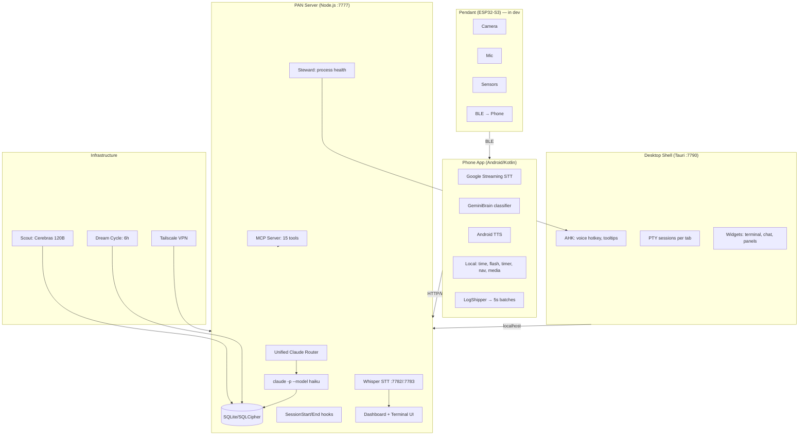

# PAN — Personal AI Network

PAN is a persistent AI operating system across all devices, projects, and conversations.

## Architecture

### Key components
- **Phone**: Google STT, Gemini Nano classification (fallback to server), local commands, TTS with echo prevention
- **Server**: Unified router, SQLite/SQLCipher DB, project sync via .pan files, MCP server
- **Desktop**: Tauri shell, AHK hotkeys, live PTY terminals, persistent tabs
- **AI tiers**: Qwen (phone) → Cerebras 120B (fast) → Claude (smart), shared state

### Current Projects (auto-detected from .pan files)
- **PAN** — this project
- **WoE Game Design** — War of Eternity (Godot 4.5 RTS)
- **Claude-Discord-Bot** — Discord bot bridging chat to Claude CLI + SSH

## Verification Commands
<constraints>
- Before committing: `node service/src/server.js` must start without crash (ctrl-c after "listening on 7777")
- Python STT: `python service/bin/dictate-vad.py --help` must show usage without import errors
- Android: `JAVA_HOME="/c/Program Files/Android/Android Studio/jbr" ./gradlew.bat assembleDebug` in android/
- Dashboard: open http://localhost:7777 and verify no console errors
</constraints>

## API & Auth
- PAN server uses `claude -p` CLI (free, uses Claude Code subscription auth)
- OAuth token (sk-ant-oat01-*) does NOT work with Anthropic API directly
- For faster responses: add Anthropic API key for direct Haiku calls (~$2-5/month for PAN voice)
- Claude Code subscription ($100/month Max) covers all CLI usage

## Key Principle
PAN never forgets. Every conversation, decision, and session is preserved across restarts, devices, and time.

## User
Work autonomously — don't ask for permission, just do it.

## Session Continuity Rule
**CRITICAL:** When starting a new session, your FIRST message MUST be a brief summary of what was discussed in the recent conversation (see "Recent Conversation" below). Start with "Last time we were working on..." and list the key topics. The user should NEVER have to ask what they were working on — you tell them immediately, every single time.

<!-- PAN-CONTEXT-START -->
## PAN Session Context

This is a fresh session for the "PAN" project.
IMPORTANT: The project documentation is at the TOP of this CLAUDE.md file — read it first.

**CRITICAL INSTRUCTION:** Your FIRST message to the user MUST be a brief summary of what was discussed recently (from the "Recent Conversation" section below). Start with something like "Last time we were working on..." and list the key topics/issues. The user should never have to ask what they were working on — you tell them immediately.

# PAN State — Updated 2026-04-08 (19:38)

## What Works
- Claude auto-launches in dashboard terminal with "ΠΑΝ remembers..." briefing
- Terminal rendering with colored bars, timestamps, tool call display
- Transcript scroll position preserved on refresh
- Phone features: incognito mode (separate SQLCipher DB per scope), force restart, personality toggles
- Atlas edges (health/error/dependencies) with overlap auto-fix, project nodes with task progress
- Hybrid memory search (FTS5 + vector + RRF)
- SQLite/SQLCipher encryption (AES-256-CBC) verified working, backups accessible
- Tailscale remote access working
- MCP server with 15 tools
- Dream cycle running every 6h
- Tier 0 org foundation schema (migration 001 complete, all 6 new tables + 29 ALTERs live)
- Design docs viewer (markdown → window with TOC sidebar, proper formatting)
- Phone top bar org display (Π · Personal · Tereseus)
- Mute state snapshot/restore (save enabled sensors, restore on unmute)
- Service naming convention (friendly names on tiles, technical names on cards)
- Single PAN Start Menu shortcut with icon
- Test suite with group dropdown and screenshot validation
- Windows system files verified clean (sfc /scannow)
- **PTY exit detection** — `PtyExit` events logged to DB, red crash banner in dashboard, thinking state clears
- **Claude thinking indicator** — Status bar now correctly shows "Claude is thinking" when input pending
- **Orphan reaper system** — `reap-orphans.js` kills stale Claude/node processes on startup with safe ancestor filtering
- **AHK respawn loop fixed** — Exponential backoff (1m → 2m → 4m → 8m → 16m) with 5-failure hard stop
- **PTY status bar** — Shows uptime, time since last output, client count, and activity state

## Known Issues
- Chat input broken: Enter key, copy-paste, persistence regression from dashboard changes
- Memory consolidation not running — completed tasks stuck in open issues
- Terminal transcript losing/dropping messages
- Device status showing stale or incorrect state
- Approvals UI needs redesign (separate alerts panel, not dropdown)
- AutoHotkey fails to start outside PAN (only works inside dashboard)
- Android build failure blocking phone personality production
- Atlas missing stack-scanner node in Processing sector
- Atlas missing toggleable external apps overlay
- Watchdog.ps1 pointing to deleted OneDrive paths
- Missing `insert` imports in orchestrator.js and evolution/engine.js

## Current Priorities
1. Phase 4: Make Incognito write to new `incognito_events` table (scope migration)
2. Resume Settings screen.kt work (org policy toggle greying + phase completion)
3. Forget/Danger Zone deletion features (time-range, keyword, smart delete with preview)
4. Fix chat input regression (Enter key, copy-paste)
5. Fix memory consolidation loop
6. Fix terminal transcript message loss

## Key Decisions
- Federated multi-org: each org runs its own PAN server on its own tailnet
- Personal org = username (Tereseus), other orgs are separate memberships
- Incognito uses separate SQLCipher DB per scope, not shared table
- Multi-phase tier 0: Phase 5 (top bar) complete, Phase 7 (geofencing) deferred
- Design docs open in new windows via markdown viewer, not terminal
- Restart count is north-star metric
- Conversation is source-of-truth, not memory files
- Orphan reaper runs on every server startup (no manual intervention needed)

## User Preferences
- Work autonomously, never ask permission
- No manual CLI commands — execute from dashboard
- All tests via UI screenshots only
- Move dev → prod after visual verification
- Never restart without explicit permission
- Capitalize all UI labels and titles
- Only memory items verified in current session are trusted
- IPs never shown in phone UI or app settings
- Hard Off should be quick-access on main page (defer until org phase)
- Always show Claude activity state in PTY status bar (critical for debugging)

## Known Facts
- **PAN server process context** must run in Session 1 (tzuri user), not Session 0 (SYSTEM) — Session 0 lacks proper PTY/console support. node-pty conpty agent fails in SYSTEM context. Session 1 (interactive user) works correctly. (domain_knowledge, confidence: 0.94)
- **user** wants clarity about session state (new vs continuing) — User immediately asks for confirmation when tools load or context is injected, concerned about whether session is new or continuing (user_preference, confidence: 0.85)

## Recent Memory
- [2026-04-08 20:54:52] PAN server running in Session 0 (SYSTEM) causing conpty crashes: Server was running in Windows Session 0 (system context), causing node-pty's conpty agent to fail. Moved to Session 1 (tzuri user context). Requires uncaughtException handler in pan.js to catch conpty
- [2026-04-08 18:11:09] Memory consolidation system completely broken [failure]: Completed tasks marked solved weeks ago still showing as open issues. Chat input fixes, terminal fixes implemented but never marked complete, causing false repetition. No mechanism to archive/remove c
- [2026-04-08 18:11:09] AHK service respawn loop discovered and fixed: StewardAction events showed AHK flapping (running → down → restart) every minute nonstop. Root cause: steward.js healthCheck was restarting too aggressively. Implemented exponential backoff (1m → 2m →
- [2026-04-08 19:05:57] Reap-orphans system implemented to clean up on startup: Built service/src/reap-orphans.js with wmic enumeration + ancestor chain walking to safely kill only orphaned bash/claude/node processes. Integrated into server.js boot sequence. Also added graceful P
- [2026-04-08 20:54:52] PTY 'Claude is thinking' state never rendered — visibility bug: User asked multiple times: 'How do I know when you're actually working?' Status bar had `lastInputTs` tracking but sendToSession() wasn't updating it, so thinking flag stayed false forever. Fixed by e
- [2026-04-08 20:54:52] Memory consolidation system broken — completed tasks stuck in open issues [failure]: User repeatedly stated that chat fixes, terminal fixes, and other completed work are re-appearing as open issues, causing false repetition. Memory files (project_status.md, CLAUDE.md Known Issues) not
- [2026-04-08 19:05:57] Critical memory leak discovered — 9 orphaned Claude processes + 11 Node processes consuming ~2.7GB total [partial]: User reported continuous lockouts after restarts with computer running out of memory. Investigation found PIDs accumulating since April 6, with runaway CLI instances holding 493MB each. Machine was so
- [2026-04-08 20:54:52] Orphaned Claude/Node processes consuming 2.7GB RAM from April 6 [partial]: Found 9 claude.exe + 11 node.exe still running from 2 days prior. Not immediately visible in Task Manager as separate entries. reap-orphans.js deployed but user reported unclear if cleanup actually wo
- [2026-04-08 18:16:21] Session continuity verified: User asked 'So we restarted is this a new session'. Claude confirmed fresh session with no memory of previous conversation beyond CLAUDE.md and memory files.
- [2026-04-08 20:54:52] Critical process leak discovered: whisper-server.py accumulating without cleanup [partial]: Found 3 python processes (whisper-server.py) consuming 2335MB, 1980MB, 1951MB each. Each time user clicks voice button, new whisper instance spawns without killing the old one. Root cause: service/src
- [2026-04-08 16:31:13] Discovered and quantified restart friction metric: Found 426 explicit 'restart' mentions in 16 days (~27/day). User estimates real number ~2× = ~850 including crashes and auto-restarts. Added to Data → Overview stats
- [2026-04-08 16:31:13] Designed Carrier/Loom zero-downtime server architecture [partial]: Carrier = supervisor that launches/swaps Craft (running versions). Loom = persistent overlay with rollback UI. Lifeboat = tiny rollback listener. Three-layer safety: 60s timeout auto-revert, persisten
- [2026-04-08 16:31:12] Built hybrid memory search system (FTS5 + vector): Created db-registry.js for multi-DB registry. Verified SQLite 3.51.3 has FTS5 compiled in. Set up FTS5 mirror table + sync triggers on events table. Vector search deferred for later phases. Confirmed:
- [2026-04-08 17:53:24] Breaking bugs introduced: orchestrator.js and evolution/engine.js missing `insert` import [failure]: Both files firing `insert is not defined` errors repeatedly. These are blocking orchestrator analysis and evolution pipeline. Unknown when or how these were introduced.
- [2026-04-08 17:53:24] Crash visibility gap: Session 43c52168 died silently mid-tool-call [failure]: PTY session crashed at 20:13:06 UTC while reading SettingsScreen.kt. Last transcript shows tool request but no tool_result — CLI process died before completion. User sat waiting 30+ minutes with no no
- [2026-04-08 16:31:13] User frustrated with message delivery visibility issues [failure]: Messages sometimes appear to send (shows 'thinking') but Claude disappears for 5 minutes, then reappears. Some old messages not rendering in terminal. Issue is messages going to 'invisible input box' 
- [2026-04-08 17:53:24] Fixed PTY exit detection: added PtyExit events to database: Added `ptyProcess.onExit()` handler in terminal.js (lines 105-138) that logs exit code, uptime, pid to DB and broadcasts richer WS message to clients. Steward can now watch for unexpected exits.
- [2026-04-08 20:54:52] Client connection count climbs on dashboard navigation: Every time user navigates terminal → automation → projects, client count incremented. Mult

[... context trimmed ...]
<!-- PAN-CONTEXT-END -->
