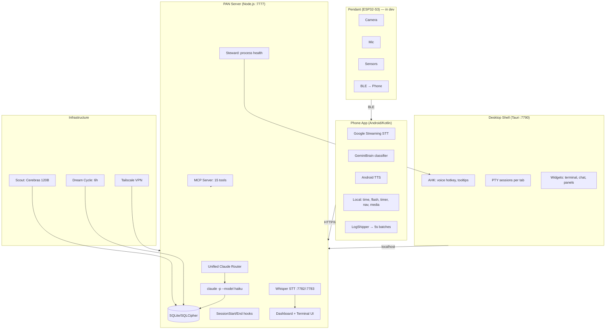

# PAN — Personal AI Network

PAN is a persistent AI operating system across all devices, projects, and conversations.

## Architecture

### Key components
- **Phone**: Google STT, Gemini Nano classification (fallback to server), local commands, TTS with echo prevention
- **Server**: Unified router, SQLite/SQLCipher DB, project sync via .pan files, MCP server
- **Desktop**: Tauri shell, AHK hotkeys, live PTY terminals, persistent tabs
- **AI tiers**: Qwen (phone) → Cerebras 120B (fast) → Claude (smart), shared state

### Current Projects (auto-detected from .pan files)
- **PAN** — this project
- **WoE Game Design** — War of Eternity (Godot 4.5 RTS)
- **Claude-Discord-Bot** — Discord bot bridging chat to Claude CLI + SSH

## Verification Commands
<constraints>
- Before committing: `node service/src/server.js` must start without crash (ctrl-c after "listening on 7777")
- Python STT: `python service/bin/dictate-vad.py --help` must show usage without import errors
- Android: `JAVA_HOME="/c/Program Files/Android/Android Studio/jbr" ./gradlew.bat assembleDebug` in android/
- Dashboard: open http://localhost:7777 and verify no console errors
</constraints>

## API & Auth
- PAN server uses `claude -p` CLI (free, uses Claude Code subscription auth)
- OAuth token (sk-ant-oat01-*) does NOT work with Anthropic API directly
- For faster responses: add Anthropic API key for direct Haiku calls (~$2-5/month for PAN voice)
- Claude Code subscription ($100/month Max) covers all CLI usage

## Key Principle
PAN never forgets. Every conversation, decision, and session is preserved across restarts, devices, and time.

## User
Work autonomously — don't ask for permission, just do it.

## Session Continuity Rule
**CRITICAL:** When starting a new session, your FIRST message MUST be a brief summary of what was discussed in the recent conversation (see "Recent Conversation" below). Start with "Last time we were working on..." and list the key topics. The user should NEVER have to ask what they were working on — you tell them immediately, every single time.

<!-- PAN-CONTEXT-START -->
## PAN Session Context

This is a fresh session for the "PAN" project.
IMPORTANT: The project documentation is at the TOP of this CLAUDE.md file — read it first.

**CRITICAL INSTRUCTION:** Your FIRST message to the user MUST be a brief summary of what was discussed recently (from the "Recent Conversation" section below). Start with something like "Last time we were working on..." and list the key topics/issues. The user should never have to ask what they were working on — you tell them immediately.

# PAN State — Updated 2026-04-06 (13:36)

## What Works
- SQLite DB encrypted with SQLCipher (AES-256-CBC)
- Tailscale remote access working
- Phone commands: flashlight, timer, alarm, navigation, search, media controls
- Browser extension: 10+ actions
- MCP server with 15 tools wrapping PAN HTTP API
- Dream cycle runs every 6h
- Context briefing system working via SessionEnd injection
- Window registry supports labeled Tauri windows (e.g. "dev", "prod")
- `/api/v1/ui` endpoints: `list_windows`, `screenshot`, `focus` with windowId routing
- Tauri `/open` accepts `label` for deterministic window identification
- Tauri `/screenshot` accepts `windowId` and captures correct monitor
- Node.js dashboard server on port 7777
- Tauri desktop shell on port 7790 with PAN Π icon
- Fast Whisper STT with 1.4s end-silence delay, batch-only mode
- AHK script launched via Tauri resolves Windows session boundary
- Hard restart via settings button triggers full process restart
- All live PTY sessions restored on page refresh
- Terminal status messages no longer corrupt screen buffer
- `.left-content` and `.chat-container` prevent horizontal overflow
- Tabs are permanent in DB with `closed_at` and `claude_session_ids`
- PTY dynamically resizes based on container width (px → columns)
- Approval keys (1/2/3) only trigger when pending approval exists
- Health checks now run asynchronously without blocking event loop
- Bash and MCP tool permissions are allowlisted (effective next session)
- Voice input uses batch MediaRecorder with single active tab enforcement
- WebSocket broadcast for voice respects active tab focus and session scope
- Terminal scroll regions reset correctly on buffer switch
- Frontend deduplication ensures only one transcription per utterance across tabs
- Input box auto-grows up to 10 lines during voice input
- Voice transcription no longer duplicates text on partial updates
- AHK tooltip shows only "Π Listening" with no extra text or actions
- New `client_logs` table in DB with indexes for device, level, created_at, device_type
- New log endpoints: `POST /api/v1/logs`, `GET /api/v1/logs`, `GET /api/v1/logs/summary`, `DELETE /api/v1/logs`
- Android `LogShipper.kt` batches logs every 5s with retry and OOM protection
- Terminal overflow fixed: code blocks wrap or scroll without overlapping
- Mic button works via server-side Whisper with streaming partials
- `dictate-vad.py` plays stop sound correctly (G4, 100ms)
- Steward uses `schtasks` to launch AHK (working reliably)
- AHK `SoundPlay` now plays full start tone (C5+E5, 150ms) without cut-off
- XButton2 mouse hotkey functional after AHK reload and file sync
- Desktop `Voice.ahk` synchronized with PAN version and reloaded
- Mermaid architecture diagram in CLAUDE.md improves parsing and token efficiency
- `.claude/settings.json` deny rules block destructive ops and secrets exposure
- PreToolUse and PostToolUse hooks now active for Bash and MCP tools
- Governance config (`governance.md`) is now scanned by evolution engine
- Win+H global shortcut now intercepted before WebView2 via Tauri shell fix

## Known Issues
- Terminal rendering lag due to VT100 state machine complexity
- Unreliable scroll region handling may lead to buffer corruption
- Steward lacks active health checks for interval services
- `reportServiceRun()` is defined but never called by services

## Current Priorities
1. Fix terminal rendering lag and potential buffer corruption
2. Implement steward health checks and service run reporting
3. Investigate file-based terminal rendering (append-only HTML log)
4. Support two concurrent terminals for parallel workflows
5. Enhance sensor pages with category-based data speed lookups

## Key Decisions
- STT engine choice must be settings-driven, not hardcoded
- GUI processes (e.g. AHK) must be launched via Tauri due to Windows session isolation
- Each dashboard tab is a named bookmark to a persistent conversation thread
- Tauri windows must be labeled at creation for reliable identification and targeting
- Background AI (Dream, Scout) requires 30B+ models — using Cerebras 120B
- Interactive terminal uses Claude; embeddings via local Ollama 7B
- Server-side terminal rendering (@xterm/headless) is standard
- Universal device telemetry requires a common log protocol and ingestion endpoint

## User Preferences
- Do everything autonomously — never ask for manual commands
- Understand full architecture before building
- Visual test verification required for all changes
- Logo area in sidebar reserved for user company/app icons
- Test in prod only after full system understanding
- Avoid unnecessary restarts — they break context and session state

## Known Facts
- **user_correction** stated creating new sessions (user_preference, confidence: 0.9)
- **user_preference** wants to do for tasks and stuff like that (user_preference, confidence: 0.8)
- **user_correction** stated goes away never disappears in this input So I can go to other tabs and come back and still there and then we gotta fix the fucking device list (user_preference, confidence: 0.9)
- **CLAUDE.md injection** happens before SessionStart hooks run — Claude Code reads CLAUDE.md into context before command hooks execute. Writing to CLAUDE.md in hooks is invisible to current session (process, confidence: 0.95)
- **Voice-to-text memory system** should track raw voice input plus corrections/preferences per project — Critique prompt was dumping 49 raw voice transcriptions creating a 124,574 character prompt that exceeded evolution timeout. Memory should compress raw input to corrections only (domain_knowledge, confidence: 0.9)
- **user_preference** wants what the fuck we just talked about (user_preference, confidence: 0.8)
- **user_preference** wants to see where this is coming from (user_preference, confidence: 0.8)
- **xterm.js auto-scroll** caused by 5 code sources plus scrollOnOutput/scrollOnUserInput options — Terminal was force-scrolling to bottom from multiple places: doFit(), WebSocket handler, tab switches, view mode button, plus xterm.js built-in options (codebase, confidence: 0.95)
- **user_correction** stated need to do all this shit again you probably did it like 50 times just look in the database of what you did before of how you found the data (user_preference, confidence: 0.9)
- **user_correction** stated do at the end of the day (user_preference, confidence: 0.9)
- **user_preference** wants to use the desktop session to actually start pan and we're actually doing it correctly (user_preference, confidence: 0.8)
- **user_correction** stated understand why you would delete the test Why wouldn't you keep the last like 10 tests the results (user_preference, confidence: 0.9)
- **user_preference** wants that nothing was missed and then I'll confirm to delete it (user_preference, confidence: 0.8)
- **user_correction** stated think it did I Click to restart (user_preference, confidence: 0.9)
- **user_correction** stated look at the fucking clipboard look in the fucking conversation (user_preference, confidence: 0.9)
- **user_correction** stated know if you can do it like that so then I can try and type in between you to see if it appears in the transcript (user_preference, confidence: 0.9)
- **Voice button implementation** mechanism Win+H via PowerShell keybd_event — Voice recording button should trigger Windows voice-to-text (Win+H) by calling PowerShell's keybd_event function on the server side (codebase, confidence: 0.6)
- **user_preference** wants it's the same size as the chat bubble one right that's all I would say (user_preference, confidence: 0.8)
- **user_correction** stated want you to I want you to understand everything that's going on before you decide to do the same thing 15 times a row (user_preference, confidence: 0.9)

## Recent Memory
- [2026-04-01 20:37:25] Mapped complete PAN memory system with three scopes and three thinking systems: Memory should be scoped per-terminal, per-project, and global. Three independent processes: Consolidation (extract episodes/facts/procedures), Dream Cycle (rewrite pan-state.md with what's solved/open
- [2026-04-01 20:37:25] Identified memory system architecture issue: CLAUDE.md read before SessionStart hooks [failure]: Claude Code reads CLAUDE.md before SessionStart command hooks run. Writing to CLAUDE.md in hooks is invisible to current session. This breaks the context injection pipeline
- [2026-04-01 14:03:43] Critical correction: Always use PAN database, never git or guessing: User explicitly stated to check PAN database for prompts and session context, not git history or file searching. This was due to Claude making incorrect assumptions about what was already built
- [2026-04-01 20:37:25] Discovered terminal was being force-scrolled to bottom by 5 different code sources [partial]: Found auto-scroll triggers in: doFit() on resize, WebSocket output handler, two tab switches, view mode button. Also xterm.js has scrollOnOutput and scrollOnUserInput options causing auto-scroll
- [2026-04-01 20:37:25] Discovered evolution system running 49 times with 45-second timeout failures [failure]: Critique prompt was 124,574 characters (~31,000 tokens) due to dumping entire raw voice transcriptions. SDK timeout is 45 seconds, maxTokens 2000. Evolution pipeline couldn't complete
- [2026-04-01 20:37:25] User decision: replace xterm.js with custom HTML/WebSocket terminal [partial]: xterm.js is too janky with unreliable scroll behavior. Plan to build simple <pre>/
 rende

[... context trimmed ...]
<!-- PAN-CONTEXT-END -->
