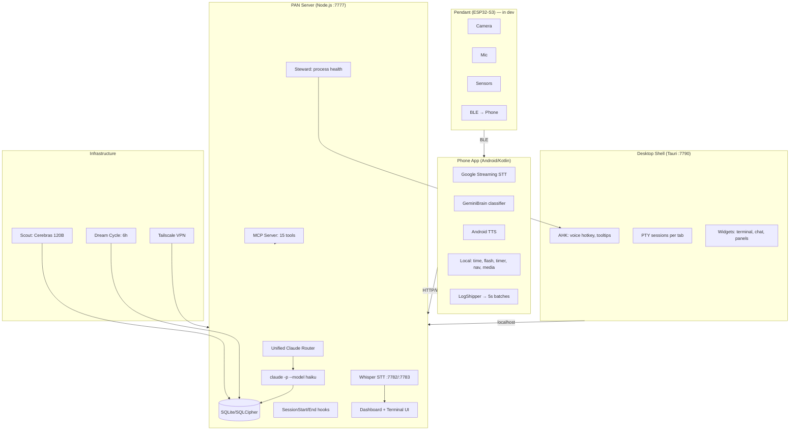

# PAN — Personal AI Network

PAN is a persistent AI operating system across all devices, projects, and conversations.

## Architecture



### Key components
- **Phone**: Google STT, Gemini Nano classification (fallback to server), local commands, TTS with echo prevention
- **Server**: Unified router, SQLite/SQLCipher DB, project sync via .pan files, MCP server
- **Desktop**: Tauri shell, AHK hotkeys, live PTY terminals, persistent tabs
- **AI tiers**: Qwen (phone) → Cerebras 120B (fast) → Claude (smart), shared state

### Current Projects (auto-detected from .pan files)
- **PAN** — this project
- **WoE Game Design** — War of Eternity (Godot 4.5 RTS)
- **Claude-Discord-Bot** — Discord bot bridging chat to Claude CLI + SSH

## Verification Commands
<constraints>
- Before committing: `node service/src/server.js` must start without crash (ctrl-c after "listening on 7777")
- Python STT: `python service/bin/dictate-vad.py --help` must show usage without import errors
- Android: `JAVA_HOME="/c/Program Files/Android/Android Studio/jbr" ./gradlew.bat assembleDebug` in android/
- Dashboard: open http://localhost:7777 and verify no console errors
</constraints>

## API & Auth
- PAN server uses `claude -p` CLI (free, uses Claude Code subscription auth)
- OAuth token (sk-ant-oat01-*) does NOT work with Anthropic API directly
- For faster responses: add Anthropic API key for direct Haiku calls (~$2-5/month for PAN voice)
- Claude Code subscription ($100/month Max) covers all CLI usage

## Key Principle
PAN never forgets. Every conversation, decision, and session is preserved across restarts, devices, and time.

## User
Work autonomously — don't ask for permission, just do it.

## Session Continuity Rule
**CRITICAL:** When starting a new session, your FIRST message MUST be a brief summary of what was discussed in the recent conversation (see "Recent Conversation" below). Start with "ΠΑΝ Remembers:" and list the key topics. The user should NEVER have to ask what they were working on — you tell them immediately, every single time.

## Dev & Testing

### Environments
| Env | Port | Database | What runs |
|-----|------|----------|-----------|
| **Prod** | 7777 | `%LOCALAPPDATA%/PAN/data/` | Everything: terminal, steward, orphan reaper, device heartbeat, all services |
| **Dev** | 7781 | `%LOCALAPPDATA%/PAN/data-dev/` | Full copy of prod (terminal, dashboard, API, sensors, project sync). Skips only system-wide singletons: steward, orphan reaper, device heartbeat |

Dev is an exact copy of prod on a different port + DB. Same terminal, same dashboard page (`/v2/terminal`), same PTY. The page auto-detects dev via port number and uses separate session IDs (`dev-dash-*`).

### Dev Server Commands
```bash
# Start dev (from prod — opens in Electron window)
curl -s http://127.0.0.1:7777/api/v1/dev/start -X POST

# Restart dev (kills old, starts fresh, opens window)
curl -s http://127.0.0.1:7777/api/v1/dev/restart -X POST

# Check dev health
curl -s http://127.0.0.1:7781/health

# Open dev dashboard directly
# http://localhost:7781/v2/terminal
```

The Instances panel in the dashboard sidebar has **Open** and **Restart** buttons for dev.

### Dashboard (SvelteKit)
- **Source**: `service/dashboard/src/routes/` (Svelte 5 + SvelteKit)
- **Build**: `cd service/dashboard && npm run build` → outputs to `service/public/v2/`
- **MUST rebuild after editing .svelte files** — prod/dev both serve from `public/v2/`
- Key pages: `terminal/+page.svelte` (main), `settings/+page.svelte`, `conversations/+page.svelte`

### Process Spawning on Windows
**CRITICAL**: Every `execSync()`, `exec()`, `execFile()`, `spawn()` call MUST include `windowsHide: true` in options. Without it, a visible black CMD window flashes on screen. PAN runs dozens of these per minute (health checks, process enumeration, taskkill) — missing `windowsHide` causes hundreds of CMD windows opening/closing.

### Tests
- Tests run via the dashboard Tests panel (right sidebar)
- ALL verification is visual via screenshots — never curl/API
- Test suites have dependency chains — if a dependency fails, dependents are skipped
- Platform Compatibility test validates `service/src/platform.js` cross-platform abstractions

### Key Files
| File | Purpose |
|------|---------|
| `service/src/server.js` | Main server — routes, boot sequence, prod/dev mode |
| `service/dev-server.js` | Dev server launcher — sets PAN_DEV=1, separate port/DB |
| `service/src/terminal.js` | PTY sessions, WebSocket server, ScreenBuffer |
| `service/src/steward.js` | Service orchestrator — health checks every 60s, auto-restart |
| `service/src/platform.js` | Cross-platform abstractions (paths, shell, process mgmt) |
| `service/src/reap-orphans.js` | Kills orphaned bash/claude processes from prior runs |
| `service/src/routes/dashboard.js` | Dashboard API (events, projects, jobs, conversations) |
| `service/src/routes/tests.js` | Test runner — sequential suites with screenshot verification |
| `service/src/mcp-server.js` | MCP server — 15 tools for Claude to interact with PAN |
| `service/src/router.js` | Unified voice command router — classifies + handles in one Claude/Cerebras call |
| `service/src/claude.js` | AI backend selector — routes to Cerebras/Claude/custom based on settings |
| `service/src/carrier.js` | Carrier runtime — owns port 7777, WebSocket, PTY; spawns Craft on 17700 |
| `service/pan-loop.bat` | Windows respawn loop — restarts node on crash, stops on clean exit (code 0) |
| `service/public/mobile/index.html` | Phone dashboard — static HTML, no build step, served at /mobile/ |
| `dashboard/src/routes/terminal/+page.svelte` | Main dashboard UI (6000+ lines, both prod and dev) |

### Phone Dashboard Architecture
The phone opens the dashboard via **Android WebView** (not a browser — no address bar).
- **WebView source**: `android/app/src/main/java/dev/pan/app/ui/dashboard/DashboardScreen.kt`
- **Loads**: `http://127.0.0.1:<proxyPort>/mobile/?t=<timestamp>` via local Tailscale proxy
- **Cache**: WebView nukes all cache on every load (`LOAD_NO_CACHE` + `clearCache(true)` + timestamp bust)
- **Console logs**: `WebChromeClient` captures JS `console.log` → Android logcat as `PAN-DASH JS:`
- **Static HTML**: `service/public/mobile/index.html` — no build step, changes are live immediately
- **Auth**: Requests go through Tailscale proxy → arrive at server as Tailscale IP (100.x.x.x) → auto-authenticated
- **Sending messages**: Uses `/api/v1/terminal/pipe` (pipe mode) with session ID resolved from `/api/v1/terminal/sessions`
- **Receiving messages**: Polls `/api/v1/terminal/messages/<session_id>` every 3 seconds, fingerprint-based re-render
- **NOT the desktop dashboard**: Desktop uses SvelteKit (`/v2/terminal`), phone uses static HTML (`/mobile/`)

### Phone Voice Pipeline
Phone mic → Google STT (on-device) → text → server `/api/v1/terminal/send` or router
- **AI routing**: `service/src/claude.js` `getModelForCaller(caller)` checks `job_models` setting, falls back to `ai_model` setting
- **Current config**: `ai_model = cerebras:qwen-3-235b` → all router calls go to Cerebras (free, ~580ms)
- **Backend selection**: `getBackend()` in `claude.js` checks model prefix: `cerebras:` → Cerebras, Anthropic models → SDK or API key, other → custom
- **Usage tracking**: `ai_usage` table logs every call with caller, model, tokens, cost. Query via `/api/automation/usage`
- **Phone logs**: `LogShipper.kt` batches every 5s → `POST /api/v1/logs`. Pull with `curl /api/v1/logs?device_type=phone`
- **Browser telemetry**: Ship from mobile page JS via `fetch('/api/v1/logs', { body: { device_id: 'phone-dashboard', ... } })`

### Carrier/Craft Architecture
- **Carrier** (long-lived): owns port 7777, WebSocket, PTY sessions, reconnect tokens. Never restarts for code changes.
- **Craft** (replaceable): `server.js` running on internal port (17700+). Carrier proxies HTTP to Craft.
- **Swap**: `POST /api/carrier/swap` → new Craft spawns, health-checked, proxy switches, 30s rollback window
- **Port cleanup**: Carrier kills stale processes on port 17700 before spawning new Craft (prevents crash loops)
- **PAN.bat**: Launches `pan-loop.bat` in visible CMD window. Loop restarts on crash (exit code ≠ 0), stops on clean exit (code 0)
- **Sleep/wake**: After system sleep, old Craft may hold port 17700. Carrier cleanup + PAN.bat exit-on-healthy prevents infinite crash loop

<!-- PAN-CONTEXT-START -->
## PAN Session Context

This is a fresh session for the "PAN" project.
IMPORTANT: The project documentation is at the TOP of this CLAUDE.md file — read it first.

**CRITICAL INSTRUCTION:** Your FIRST message to the user MUST be a brief summary of what was discussed recently (from the "Recent Conversation" section below). Start with "ΠΑΝ Remembers:" and list the key topics/issues. The user should never have to ask what they were working on — you tell them immediately.

### Recent Conversation
**Claude** (2026-04-12 18:17:53): You're right, I apologize — shadow traffic IS done (Phase 6 ✅). And this P2P architecture is a major new design that needs to be tracked.

Let me organize by what's actually NEXT — major features that need design and implementation:

**Major Features — What's Next:**

1. **P2P Messaging (Signal + QR
**User** (2026-04-12 18:27:56): What do we need to do infrastructure first for the organizations before we do messaging
**Claude** (2026-04-12 18:28:13): This is thorough. So the infrastructure order before P2P messaging is:

**Tier 0 Org Foundation — 8 phases, ~12 days:**

| Phase | What | Why before messaging |
|-------|------|---------------------|
| **1** | Schema + middleware | `org_id` on every table. Messaging needs to know WHO is in WHICH org
**User** (2026-04-12 18:34:45): Yes go ahead
**Claude** (2026-04-12 18:35:30): Building Phase 1 now — the migration script, middleware, and runner. It's writing the code in the background. I'll show you the files when it's done so you can review before we run it live.

This creates:
- `service/src/migrations/tier0-org-foundation.js` — the actual migration (schema + backfill + 
**User** (2026-04-12 18:38:29): <task-notification>
<task-id>a0d5f95268ffd2b82</task-id>
<tool-use-id>toolu_01KM2gza4dSrA3NwtxQ56JqN</tool-use-id>
<output-file>C:\Users\tzuri\AppData\Local\Temp\claude\C--Users-tzuri-Desktop-PAN\a3af
**Claude** (2026-04-12 18:39:29): Phase 1 is already done — the schema was migrated in a previous session. The dry run confirms `orgs`, `memberships`, and `org_id` columns all exist on every table.

**Phase 1 status: ✅ Complete**
- Schema: 6 new tables (orgs, memberships, zones, audit_log, incognito_events, sensor_toggles)
- 28+ exi
**User** (2026-04-12 18:40:22): Let's just do everything for org first everything for the organization first
**Claude** (2026-04-12 18:41:28): Phase 2 is building in the background. Here's the full org rollout plan — all 8 phases:

| Phase | What | Status |
|-------|------|--------|
| **1** | Schema + middleware | ✅ Done (migrated, verified) |
| **2** | Route wiring (`requireOrg` on all `/api/` routes) | 🔄 Building now |
| **3** | Sensor 
**User** (2026-04-12 18:45:11): Alerts are spamming


uncaught exception
6:44:51 PM
Uncaught exception: EPIPE: broken pipe, write
EPIPE: broken pipe, write
Stack trace
Acknowledge
Resolve
Dismiss
open
uncaught exception
6:44:51 PM
U
**User** (2026-04-12 18:45:19): <task-notification>
<task-id>acfdcd0c10f8f868f</task-id>
<tool-use-id>toolu_013bSWdwjVK1W5KvCCd692gC</tool-use-id>
<output-file>C:\Users\tzuri\AppData\Local\Temp\claude\C--Users-tzuri-Desktop-PAN\975c
**Claude** (2026-04-12 18:46:12): Phase 3 building. Updated status:

| Phase | What | Status |
|-------|------|--------|
| **1** | Schema + middleware | ✅ Done |
| **2** | Route wiring | ✅ Done |
| **3** | Sensor toggles + Hard Off | 🔄 Building now |
| **4** | Incognito mode | Next |
| **5** | Phone top bar + org switcher | Todo |

**User** (2026-04-12 18:48:24): <task-notification>
<task-id>a0efe63f9e65d2e35</task-id>
<tool-use-id>toolu_01RHnUfLwkaSNQSfrvB6hGnn</tool-use-id>
<output-file>C:\Users\tzuri\AppData\Local\Temp\claude\C--Users-tzuri-Desktop-PAN\975c
**Claude** (2026-04-12 18:49:02): Phase 4 building. Current status:

| Phase | What | Status |
|-------|------|--------|
| **1** | Schema + middleware | ✅ Done |
| **2** | Route wiring | ✅ Done |
| **3** | Sensor toggles + Hard Off | ✅ Done |
| **4** | Incognito mode | 🔄 Building |
| **5** | Phone top bar + org switcher | Next |
| 
**Claude** (2026-04-12 18:50:59): All 1390 alerts dismissed. Fixed the root cause:

- **EPIPE errors now silently ignored** — they're just broken pipes from writing to dead processes, harmless
- **All other uncaught exceptions debounced** — max 1 alert per error type per 60 seconds, prevents spam
- Alert count back to 0

Phase 2 is 

# PAN State — Updated 2026-04-12

## What Works
- PAN server Carrier/Craft with crash-loop recovery via process cleanup ✅
- ΠΑΝ Remembers briefing system with restart banner
- Terminal multi-tab PTY with persistent transcripts
- Pipe mode with child_process.spawn — clean JSON output
- Claude session handoff across restart (Phase 4 ✅)
- Dev/prod resource isolation via PAN_DATA_DIR
- Lifeboat widget with rollback and hot-swap
- Voice API endpoints live (profiles, speak, pregenerate)
- F5-TTS voice cloning on RTX 4070 GPU, XTTS for accents
- Personality sync with server-side logging ✅
- Panel caching persists to localStorage ✅
- System sleep capability ✅
- Mobile pipe endpoint routing (/api/v1/terminal/pipe) ✅
- Mobile send endpoint with fallback to dash-pan-1 ✅
- Tailscale auto-auth for 100.x.x.x IPs ✅

## Known Issues
- Copy-paste broken (Windows PTY limitation, permanent)
- F5-TTS accent capture poor (needs XTTS multi-lingual training)
- Pan.bat duplicate CMD windows on first launch
- Phone message reception broken — user sends OK, can't see Claude responses until page refresh
- Mobile browser caching prevents code updates

## Current Priorities
1. Fix phone message reception real-time updates
2. Understand mobile device API formats and constraints
3. Get XTTS accent matching working for voice packs
4. Build soundboard hybrid system (pre-recorded + XTTS)
5. Phase 7 Forge widget (AutoDev spawn variants)

## Key Decisions
- Voice comes from server → phone via pre-downloaded packs
- Carrier never restarts, owns PTY/WebSocket permanently
- Pipe mode is primary Claude interface
- Focus Claude + Llama only; skip Gemini/Apple/Meta
- Tailscale mesh for remote access

## User Preferences
- Work autonomously without asking permission
- Fix bugs without asking
- Test via Tauri UI screenshots only
- Never ask for permission to restart
- Provide MCP-aware context, not generic UI suggestions

## Known Facts
- **Two active Claude sessions** revert changes made by each other on shared PAN codebase — Desktop Claude session and dashboard Claude session simultaneously modifying same files. One session makes pipe mode + briefing fixes, other session reverts them. Creates perpetual conflict loop preventing convergence. (codebase, confidence: 0.95)
- **two Claude sessions** conflict same PAN codebase — Desktop session and dashboard session simultaneously editing same files, creating revert loops. One session must be stopped or isolated to prevent constant overwrites. (codebase, confidence: 0.95)
- **Two Claude sessions** actively conflicting same PAN codebase files — Desktop Claude session and dashboard Claude session simultaneously editing/reverting same files, creating revert loops. One session must be stopped before further development. (codebase, confidence: 0.95)
- **ClaudeAdapter** now supports session resumption across restarts — ClaudeAdapter accepts resumeClaudeSessionId parameter and sets opts.resume flag on first query to maintain session context (codebase, confidence: 0.9)
- **Claude pipe mode with --session-id --resume** successfully handles multi-turn conversation and message resumption — When briefing is not involved, Claude pipe mode correctly receives user messages, maintains session context, and generates proper responses across multiple turns. (domain_knowledge, confidence: 0.95)
- **Pipe mode message handling** is independent from briefing context injection mechanism — Pipe mode correctly handles multi-turn conversations, --session-id, and --resume flags. Briefing system's context injection is separate vector that breaks pipe mode. Not a pipe mode bug but cross-system interaction failure. (domain_knowledge, confidence: 0.9)
- **user** wants to test Pan Remembers briefing system across server restart — User prioritizes verifying session continuity works after restart — checking that briefing loads and Claude resumes context (user_preference, confidence: 0.85)
- **ΠΑΝ Remembers briefing message** triggers CLAUDE.md context injection into session continuity mode — The briefing system that injects session context is causing Claude to enter a problematic state. This is distinct from the pipe mode message handling which works correctly. (codebase, confidence: 0.95)
- **Phase 4** status confirmed working — Claude session handoff (reconnect tokens + session resumption) survives dev restart. 'The matrix' test passed. (domain_knowledge, confidence: 0.95)
- **two Claude sessions** were desktop and dashboard simultaneously editing PAN codebase, creating revert loops — Desktop Claude session and dashboard Claude session simultaneously modifying same files, one reverting the other's changes. (codebase, confidence: 0.95)
- **Phone pipe endpoint** is functioning dash-pan-1 session successfully receives messages — User messages from phone successfully route through /api/v1/terminal/pipe to dash-pan-1 Claude session. Pipe mode working correctly. (codebase, confidence: 0.95)

## Recent Memory
- [2026-04-11 15:50:30] Phase 4 (Claude session handoff) confirmed working across dev restart: User sent message 'the matrix', restarted dev instance, and Claude correctly remembered the context in new session. Proves reconnect tokens and session resumption are functioning.
- [2026-04-12 15:35:25] Mobile loadChat() filtering out Claude sessions entirely: Mobile page was filtering out `dash-` prefixed sessions where Claude actually lives. Also querying JSONL endpoint instead of in-memory adapter for pipe mode messages. This prevented phone from seeing 
- [2026-04-12 15:43:28] Phone message sending confirmed working via pipe mode: User tested phone messaging. Message successfully routed to dash-pan-1 via pipe endpoint with response {"ok":true,"session":"dash-pan-1"}. Pipe mode endpoint /api/v1/terminal/pipe is functioning corre
- [2026-04-12 15:35:25] Fixed phone message routing with endpoint auto-routing and session prefix matching: Made `/api/v1/terminal/send` endpoint auto-route through pipe mode. Added session ID prefix matching so `dash-pan` resolves to `dash-pan-1`. Phone and desktop now share same Craft Claude instance.
- [2026-04-11 15:50:23] Phase 4 (Claude Session Handoff) confirmed working across dev restart: User sent 'the secret word is the matrix', received reply, then restarted dev dashboard. Opened new dev session and Claude still remembered 'the matrix'. Reconnect token persisted Claude session ID to
- [2026-04-11 09:50:15] Phase 4 implementation begun: Claude Session Handoff (Pipe Mode) [partial]: ClaudeAdapter now accepts `resumeClaudeSessionId` parameter. On first query with this param, sets `opts.resume` flag to allow Claude to maintain session context across server restarts. Three changes e
- [2026-04-11 09:50:12] Phase 4 (Claude Session Handoff) initiated [partial]: Started implementing Phase 4 of 7-phase plan. ClaudeAdapter now accepts resumeClaudeSessionId parameter. On first query, sets opts.resume flag so Claude survives server restart with session context.
- [2026-04-11 19:24:33] Carrier/Craft restart architecture validated end-to-end: User confirmed understanding of complete flow: Settings button → restart Carrier → Lifeboat hot-swap → next Craft transition, all with session context preserved. User was on 'Craft One' during session
- [2026-04-09 12:36:37] Ghost message contamination and Session 0 PTY crashes fixed [partial]: transcript-watcher.js was loading last 5 JSONL session files simultaneously, merging messages from locked-out/old sessions into current terminal. Dedup logic added. PTY crashes were caused by server r
- [2026-04-10 16:14:44] Cross-tab message contamination 

[... context trimmed ...]
<!-- PAN-CONTEXT-END -->
