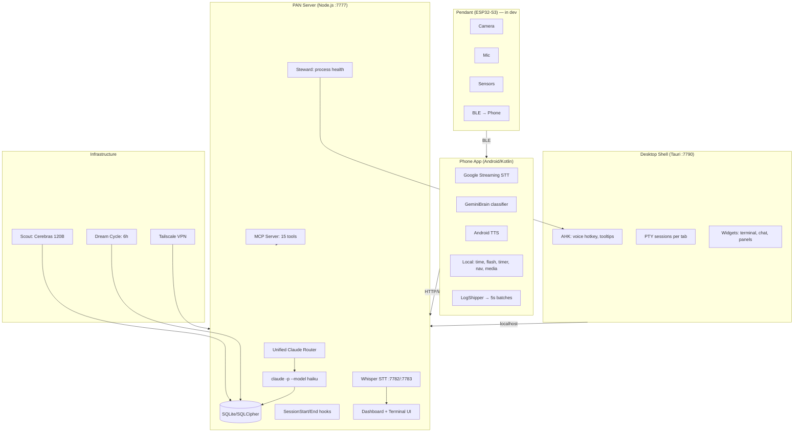

# PAN — Personal AI Network

PAN is a persistent AI operating system across all devices, projects, and conversations.

## Architecture



### Key components
- **Phone**: Google STT, Gemini Nano classification (fallback to server), local commands, TTS with echo prevention
- **Server**: Unified router, SQLite/SQLCipher DB, project sync via .pan files, MCP server
- **Desktop**: Tauri shell, AHK hotkeys, live PTY terminals, persistent tabs
- **AI tiers**: Qwen (phone) → Cerebras 120B (fast) → Claude (smart), shared state

### Current Projects (auto-detected from .pan files)
- **PAN** — this project
- **WoE Game Design** — War of Eternity (Godot 4.5 RTS)
- **Claude-Discord-Bot** — Discord bot bridging chat to Claude CLI + SSH

## Verification Commands
<constraints>
- Before committing: `node service/src/server.js` must start without crash (ctrl-c after "listening on 7777")
- Python STT: `python service/bin/dictate-vad.py --help` must show usage without import errors
- Android: `JAVA_HOME="/c/Program Files/Android/Android Studio/jbr" ./gradlew.bat assembleDebug` in android/
- Dashboard: open http://localhost:7777 and verify no console errors
</constraints>

## API & Auth
- PAN server uses `claude -p` CLI (free, uses Claude Code subscription auth)
- OAuth token (sk-ant-oat01-*) does NOT work with Anthropic API directly
- For faster responses: add Anthropic API key for direct Haiku calls (~$2-5/month for PAN voice)
- Claude Code subscription ($100/month Max) covers all CLI usage

## Key Principle
PAN never forgets. Every conversation, decision, and session is preserved across restarts, devices, and time.

## User
Work autonomously — don't ask for permission, just do it.

## Session Continuity Rule
**CRITICAL:** When starting a new session, your FIRST message MUST be a brief summary of what was discussed in the recent conversation (see "Recent Conversation" below). Start with "ΠΑΝ Remembers:" and list the key topics. The user should NEVER have to ask what they were working on — you tell them immediately, every single time.

## Dev & Testing

### Environments
| Env | Port | Database | What runs |
|-----|------|----------|-----------|
| **Prod** | 7777 | `%LOCALAPPDATA%/PAN/data/` | Everything: terminal, steward, orphan reaper, device heartbeat, all services |
| **Dev** | 7781 | `%LOCALAPPDATA%/PAN/data-dev/` | Full copy of prod (terminal, dashboard, API, sensors, project sync). Skips only system-wide singletons: steward, orphan reaper, device heartbeat |

Dev is an exact copy of prod on a different port + DB. Same terminal, same dashboard page (`/v2/terminal`), same PTY. The page auto-detects dev via port number and uses separate session IDs (`dev-dash-*`).

### Dev Server Commands
```bash
# Start dev (from prod — opens in Electron window)
curl -s http://127.0.0.1:7777/api/v1/dev/start -X POST

# Restart dev (kills old, starts fresh, opens window)
curl -s http://127.0.0.1:7777/api/v1/dev/restart -X POST

# Check dev health
curl -s http://127.0.0.1:7781/health

# Open dev dashboard directly
# http://localhost:7781/v2/terminal
```

The Instances panel in the dashboard sidebar has **Open** and **Restart** buttons for dev.

### Dashboard (SvelteKit)
- **Source**: `service/dashboard/src/routes/` (Svelte 5 + SvelteKit)
- **Build**: `cd service/dashboard && npm run build` → outputs to `service/public/v2/`
- **MUST rebuild after editing .svelte files** — prod/dev both serve from `public/v2/`
- Key pages: `terminal/+page.svelte` (main), `settings/+page.svelte`, `conversations/+page.svelte`

### Process Spawning on Windows
**CRITICAL**: Every `execSync()`, `exec()`, `execFile()`, `spawn()` call MUST include `windowsHide: true` in options. Without it, a visible black CMD window flashes on screen. PAN runs dozens of these per minute (health checks, process enumeration, taskkill) — missing `windowsHide` causes hundreds of CMD windows opening/closing.

### Tests
- Tests run via the dashboard Tests panel (right sidebar)
- ALL verification is visual via screenshots — never curl/API
- Test suites have dependency chains — if a dependency fails, dependents are skipped
- Platform Compatibility test validates `service/src/platform.js` cross-platform abstractions

### Key Files
| File | Purpose |
|------|---------|
| `service/src/server.js` | Main server — routes, boot sequence, prod/dev mode |
| `service/dev-server.js` | Dev server launcher — sets PAN_DEV=1, separate port/DB |
| `service/src/terminal.js` | PTY sessions, WebSocket server, ScreenBuffer |
| `service/src/steward.js` | Service orchestrator — health checks every 60s, auto-restart |
| `service/src/platform.js` | Cross-platform abstractions (paths, shell, process mgmt) |
| `service/src/reap-orphans.js` | Kills orphaned bash/claude processes from prior runs |
| `service/src/routes/dashboard.js` | Dashboard API (events, projects, jobs, conversations) |
| `service/src/routes/tests.js` | Test runner — sequential suites with screenshot verification |
| `service/src/mcp-server.js` | MCP server — 15 tools for Claude to interact with PAN |
| `dashboard/src/routes/terminal/+page.svelte` | Main dashboard UI (6000+ lines, both prod and dev) |

<!-- PAN-CONTEXT-START -->
## PAN Session Context

This is a fresh session for the "PAN" project.
IMPORTANT: The project documentation is at the TOP of this CLAUDE.md file — read it first.

**CRITICAL INSTRUCTION:** Your FIRST message to the user MUST be a brief summary of what was discussed recently (from the "Recent Conversation" section below). Start with "ΠΑΝ Remembers:" and list the key topics/issues. The user should never have to ask what they were working on — you tell them immediately.

### Recent Conversation
**Claude** (2026-04-11 19:57:10): Craft-4 is live, Craft-3 is in the rollback window. Everything's working.

So here's what's fixed:

1. **Hot swap already auto-reloads the page** — it was already coded (line 860: `window.location.reload()`). You just had to trigger the swap. The dashboard rebuild alone doesn't do anything — the swa
**User** (2026-04-11 19:57:57): You are PAN's memory consolidation system. Extract structured memories from these recent events.

EVENTS:
[2026-04-11 19:24:38] Claude: Done. Here's what changed:

**Before:** Settings restart button 
**Claude** (2026-04-11 19:58:16): ```json
{
  "episodes": [
    {
      "summary": "Settings restart button redesigned for full process replacement",
      "detail": "Before: restart button triggered Craft to tell Carrier to hot-swap (only replaced server.js, Carrier code stayed old). After: restart button spawns new 'node pan.js st
**User** (2026-04-11 19:58:21): You are PAN's memory system. You maintain a LIVING STATE DOCUMENT that tracks what's going on across the project.

CURRENT STATE DOCUMENT:
# PAN State — Updated 2026-04-11

## What Works
- PAN server 
**Claude** (2026-04-11 19:58:44): # PAN State — Updated 2026-04-11

## What Works
- PAN server running via Carrier/Craft (Phase 6 ✅ deployed)
- ΠΑΝ Remembers briefing system with restart banner
- Pipe mode with `child_process.spawn` — clean JSON output
- Per-tab PTY sessions (bash shell for terminal UI)
- Dev/prod resource isolation
**User** (2026-04-11 20:01:28): OK yeah the Crucible isn't you know a new page It doesn't need to have the sidebar the terminal automation projects it doesn't need to have that II guess or should or shouldn't Why would you want term
**Claude** (2026-04-11 20:03:13): OK that'll deploy. Now close the old Crucible window and reopen it — or the main dashboard will auto-reload and you can click Open Crucible again from Lifeboat. The sidebar will be gone.

Now to your actual question — **what is AutoDev/Forge actually used for?**

You're right that it's hard to conce
**User** (2026-04-11 20:11:24): Oh and when you say things like fix the transcript loads and messages so autodad doesn't really even become a section in automation It's happening all the time It's it's always happening so it's alway
**Claude** (2026-04-11 20:12:12): You're touching on something real here. Let me try to untangle it.

**AutoDev isn't a feature, it's a mode.** You're right — it's not a page in the sidebar. It's always on. Every time I make a change, I could be doing it through the Forge path: shadow → compare → promote. The fact that right now I j
**User** (2026-04-11 20:13:23): You are PAN's memory consolidation system. Extract structured memories from these recent events.

EVENTS:
[2026-04-11 19:58:21] User: You are PAN's memory system. You maintain a LIVING STATE DOCUMENT 
**Claude** (2026-04-11 20:13:44): ```json
{
  "episodes": [
    {
      "summary": "Crucible window UI design clarification",
      "detail": "User questioned whether Crucible needs sidebar, terminal access, and automation sections. Claude confirmed Crucible is a simpler window — sidebar removed, no terminal access. Deployment appro
**User** (2026-04-11 20:17:48): Speed of response should always be determined by not by the time by the amount of messages because I let me go away for 30 minutes and I choose the the first the first choice anyway Yeah so all those 
**Claude** (2026-04-11 20:18:07): Yeah, that's exactly what the flywheel is. Every interaction makes the next one better:

**You use PAN → PAN captures data → classifies it → updates your personality model → Forge generates better variants → you approve faster → that approval is more data → model gets sharper → even better variants 
**User** (2026-04-11 20:23:29): OK where are we at brother
**Claude** (2026-04-11 20:23:42): We just knocked out all 7 phases of the Carrier plan:

| Phase | Status | What we did this session |
|-------|--------|------------------------|
| 1 | ✅ | Already done |
| 2 | ✅ | Already done |
| 3 | ✅ | Confirmed already complete (reconnect tokens persist, frontend auto-reconnects) |
| 4 | ✅ | Alr

# PAN State — Updated 2026-04-11

## What Works
- PAN server running via Carrier/Craft (Phase 6 ✅ deployed)
- ΠΑΝ Remembers briefing system with restart banner
- Pipe mode with `child_process.spawn` — clean JSON output
- Per-tab PTY sessions (bash shell for terminal UI)
- Dev/prod resource isolation via `PAN_DATA_DIR`
- Claude session handoff across restart (Phase 4 ✅)
- Message input clears after send (no red highlight)
- Lifeboat widget showing Carrier/Craft status, rollback window, hot-swap button
- Dashboard auto-reloads on hot-swap
- Craft auto-cleanup via SIGTERM after 30s rollback window
- Lifeboat countdown timer ticks smoothly

## Known Issues
- **Terminal blank after page refresh** — transcript messages don't render until first new message arrives (user frustrated: "just fucking fix the refresh")
- HTTP fallback for messages pending (needs Carrier restart to activate `getSessionMessages` IPC handler)
- Copy-paste broken (Windows PTY limitation, permanent)
- LaTeX files won't render in markdown viewer

## Current Priorities
1. Fix terminal blank-after-refresh render bug (critical frustration point)
2. Update settings restart button to restart Carrier (not just hot-swap Craft)
3. Verify HTTP fallback (`/api/v1/terminal/messages`) works after Carrier restart
4. Build Phase 7 Forge widget (AutoDev spawn N variant Crafts)

## Key Decisions
- Carrier never restarts, owns PTY/WebSocket permanently
- Settings restart should trigger full Carrier restart (user clarified: needed for Carrier's new IPC handlers)
- Pipe mode is primary Claude interface
- Focus Claude + Llama only; skip Gemini/Apple/Meta
- Free tier + ATC demo + data marketplace as initial product

## User Preferences
- Work autonomously through PAN dashboard
- Fix bugs without asking (user: "just do it")
- Test via Tauri UI screenshots only
- Transcript system must work for ANY LLM
- Never ask for permission to restart (just do it)

## Known Facts
- **Two active Claude sessions** revert changes made by each other on shared PAN codebase — Desktop Claude session and dashboard Claude session simultaneously modifying same files. One session makes pipe mode + briefing fixes, other session reverts them. Creates perpetual conflict loop preventing convergence. (codebase, confidence: 0.95)
- **two Claude sessions** conflict same PAN codebase — Desktop session and dashboard session simultaneously editing same files, creating revert loops. One session must be stopped or isolated to prevent constant overwrites. (codebase, confidence: 0.95)
- **Two Claude sessions** actively conflicting same PAN codebase files — Desktop Claude session and dashboard Claude session simultaneously editing/reverting same files, creating revert loops. One session must be stopped before further development. (codebase, confidence: 0.95)
- **ClaudeAdapter** now supports session resumption across restarts — ClaudeAdapter accepts resumeClaudeSessionId parameter and sets opts.resume flag on first query to maintain session context (codebase, confidence: 0.9)
- **Claude pipe mode with --session-id --resume** successfully handles multi-turn conversation and message resumption — When briefing is not involved, Claude pipe mode correctly receives user messages, maintains session context, and generates proper responses across multiple turns. (domain_knowledge, confidence: 0.95)
- **Pipe mode message handling** is independent from briefing context injection mechanism — Pipe mode correctly handles multi-turn conversations, --session-id, and --resume flags. Briefing system's context injection is separate vector that breaks pipe mode. Not a pipe mode bug but cross-system interaction failure. (domain_knowledge, confidence: 0.9)
- **user** wants to test Pan Remembers briefing system across server restart — User prioritizes verifying session continuity works after restart — checking that briefing loads and Claude resumes context (user_preference, confidence: 0.85)
- **ΠΑΝ Remembers briefing message** triggers CLAUDE.md context injection into session continuity mode — The briefing system that injects session context is causing Claude to enter a problematic state. This is distinct from the pipe mode message handling which works correctly. (codebase, confidence: 0.95)
- **Phase 4** status confirmed working — Claude session handoff (reconnect tokens + session resumption) survives dev restart. 'The matrix' test passed. (domain_knowledge, confidence: 0.95)
- **broadcastNotification('chat_update')** sends to ALL WebSocket clients regardless of tab/session — In terminal.js:376, every user prompt, stop, and assistant message broadcasts to every connected terminal session across every tab without filtering by pty_session_id. This is the primary vector for cross-tab contamination. (codebase, confidence: 0.95)
- **two Claude sessions** were desktop and dashboard simultaneously editing PAN codebase, creating revert loops — Desktop Claude session and dashboard Claude session simultaneously modifying same files, one reverting the other's changes. (codebase, confidence: 0.95)

## Recent Memory
- [2026-04-11 15:50:30] Phase 4 (Claude session handoff) confirmed working across dev restart: User sent message 'the matrix', restarted dev instance, and Claude correctly remembered the context in new session. Proves reconnect tokens and session resumption are functioning.
- [2026-04-11 15:50:23] Phase 4 (Claude Session Handoff) confirmed working across dev restart: User sent 'the secret word is the matrix', received reply, then restarted dev dashboard. Opened new dev session and Claude still remembered 'the matrix'. Reconnect token persisted Claude session ID to
- [2026-04-11 19:24:33] Carrier/Craft restart architecture validated end-to-end: User confirmed understanding of complete flow: Settings button → restart Carrier → Lifeboat hot-swap → next Craft transition, all with session context preserved. User was on 'Craft One' during session
- [2026-04-11 09:50:15] Phase 4 implementation begun: Claude Session Handoff (Pipe Mode) [partial]: ClaudeAdapter now accepts `resumeClaudeSessionId` parameter. On first query with this param, sets `opts.resume` flag to allow Claude to maintain session context across server restarts. Three changes e
- [2026-04-11 09:50:12] Phase 4 (Claude Session Handoff) initiated [partial]: Started implementing Phase 4 of 7-phase plan. ClaudeAdapter now accepts resumeClaudeSessionId parameter. On first query, sets opts.resume flag so Claude survives server restart with session context.
- [2026-04-11 18:27:36] Phase 4 (Claude Session Handoff) confirmed working end-to-end: Carrier/Craft system running (PIDs confirmed), reconnect tokens + session resumption survive dev restart. 'The matrix' test passed. User is actively running on Carrier/Craft.
- [2026-04-10 16:14:44] Cross-tab message contamination confirmed and temporarily fixed, then reverted [partial]: User reported PTY exits and messages from PAN 1 tab bleeding into PAN Main despite separate PTY processes. Root cause identified: broadcastNotification('chat_update') in terminal.js sends to ALL WebSo
- [2026-04-10 22:47:34] Briefing context injection remains problematic even in pipe mode [failure]: ΠΑΝ Remembers briefing still triggers CLAUDE.md context injection that puts Claude in hang/mode shift state. Pipe mode message handling works correctly (multi-turn, --session-

[... context trimmed ...]
<!-- PAN-CONTEXT-END -->
