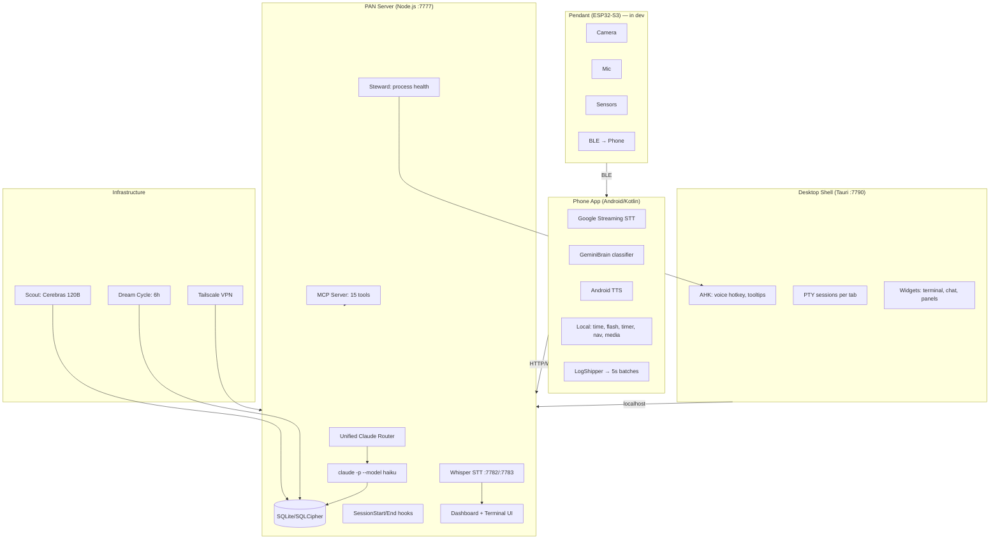

# PAN — Personal AI Network

PAN is a persistent AI operating system across all devices, projects, and conversations.

## Architecture



### Key components
- **Phone**: Google STT, Gemini Nano classification (fallback to server), local commands, TTS with echo prevention
- **Server**: Unified router, SQLite/SQLCipher DB, project sync via .pan files, MCP server
- **Desktop**: Tauri shell, AHK hotkeys, live PTY terminals, persistent tabs
- **AI tiers**: Qwen (phone) → Cerebras 120B (fast) → Claude (smart), shared state

### Current Projects (auto-detected from .pan files)
- **PAN** — this project
- **WoE Game Design** — War of Eternity (Godot 4.5 RTS)
- **Claude-Discord-Bot** — Discord bot bridging chat to Claude CLI + SSH

## Verification Commands
<constraints>
- Before committing: `node service/src/server.js` must start without crash (ctrl-c after "listening on 7777")
- Python STT: `python service/bin/dictate-vad.py --help` must show usage without import errors
- Android: `JAVA_HOME="/c/Program Files/Android/Android Studio/jbr" ./gradlew.bat assembleDebug` in android/
- Dashboard: open http://localhost:7777 and verify no console errors
</constraints>

## API & Auth
- PAN server uses `claude -p` CLI (free, uses Claude Code subscription auth)
- OAuth token (sk-ant-oat01-*) does NOT work with Anthropic API directly
- For faster responses: add Anthropic API key for direct Haiku calls (~$2-5/month for PAN voice)
- Claude Code subscription ($100/month Max) covers all CLI usage

## Key Principle
PAN never forgets. Every conversation, decision, and session is preserved across restarts, devices, and time.

## User
Work autonomously — don't ask for permission, just do it.

## Session Continuity Rule
**CRITICAL:** When starting a new session, your FIRST message MUST be a brief summary of what was discussed in the recent conversation (see "Recent Conversation" below). Start with "ΠΑΝ Remembers:" and list the key topics. The user should NEVER have to ask what they were working on — you tell them immediately, every single time.

## Dev & Testing

### Environments
| Env | Port | Database | What runs |
|-----|------|----------|-----------|
| **Prod** | 7777 | `%LOCALAPPDATA%/PAN/data/` | Everything: terminal, steward, orphan reaper, device heartbeat, all services |
| **Dev** | 7781 | `%LOCALAPPDATA%/PAN/data-dev/` | Full copy of prod (terminal, dashboard, API, sensors, project sync). Skips only system-wide singletons: steward, orphan reaper, device heartbeat |

Dev is an exact copy of prod on a different port + DB. Same terminal, same dashboard page (`/v2/terminal`), same PTY. The page auto-detects dev via port number and uses separate session IDs (`dev-dash-*`).

### Dev Server Commands
```bash
# Start dev (from prod — opens in Electron window)
curl -s http://127.0.0.1:7777/api/v1/dev/start -X POST

# Restart dev (kills old, starts fresh, opens window)
curl -s http://127.0.0.1:7777/api/v1/dev/restart -X POST

# Check dev health
curl -s http://127.0.0.1:7781/health

# Open dev dashboard directly
# http://localhost:7781/v2/terminal
```

The Instances panel in the dashboard sidebar has **Open** and **Restart** buttons for dev.

### Dashboard (SvelteKit)
- **Source**: `service/dashboard/src/routes/` (Svelte 5 + SvelteKit)
- **Build**: `cd service/dashboard && npm run build` → outputs to `service/public/v2/`
- **MUST rebuild after editing .svelte files** — prod/dev both serve from `public/v2/`
- Key pages: `terminal/+page.svelte` (main), `settings/+page.svelte`, `conversations/+page.svelte`

### Process Spawning on Windows
**CRITICAL**: Every `execSync()`, `exec()`, `execFile()`, `spawn()` call MUST include `windowsHide: true` in options. Without it, a visible black CMD window flashes on screen. PAN runs dozens of these per minute (health checks, process enumeration, taskkill) — missing `windowsHide` causes hundreds of CMD windows opening/closing.

### Tests
- Tests run via the dashboard Tests panel (right sidebar)
- ALL verification is visual via screenshots — never curl/API
- Test suites have dependency chains — if a dependency fails, dependents are skipped
- Platform Compatibility test validates `service/src/platform.js` cross-platform abstractions

### Key Files
| File | Purpose |
|------|---------|
| `service/src/server.js` | Main server — routes, boot sequence, prod/dev mode |
| `service/dev-server.js` | Dev server launcher — sets PAN_DEV=1, separate port/DB |
| `service/src/terminal.js` | PTY sessions, WebSocket server, ScreenBuffer |
| `service/src/steward.js` | Service orchestrator — health checks every 60s, auto-restart |
| `service/src/platform.js` | Cross-platform abstractions (paths, shell, process mgmt) |
| `service/src/reap-orphans.js` | Kills orphaned bash/claude processes from prior runs |
| `service/src/routes/dashboard.js` | Dashboard API (events, projects, jobs, conversations) |
| `service/src/routes/tests.js` | Test runner — sequential suites with screenshot verification |
| `service/src/mcp-server.js` | MCP server — 15 tools for Claude to interact with PAN |
| `dashboard/src/routes/terminal/+page.svelte` | Main dashboard UI (6000+ lines, both prod and dev) |

<!-- PAN-CONTEXT-START -->
## PAN Session Context

This is a fresh session for the "PAN" project.
IMPORTANT: The project documentation is at the TOP of this CLAUDE.md file — read it first.

**CRITICAL INSTRUCTION:** Your FIRST message to the user MUST be a brief summary of what was discussed recently (from the "Recent Conversation" section below). Start with "ΠΑΝ Remembers:" and list the key topics/issues. The user should never have to ask what they were working on — you tell them immediately.

### Recent Conversation
**User** (2026-04-10 23:07:54): Say MANGO
**Claude** (2026-04-10 23:07:56): MANGO
**User** (2026-04-10 23:09:55): What is the capital of France? One word.
**Claude** (2026-04-10 23:09:57): Paris.
**User** (2026-04-10 23:11:40): What is 2+2? One word answer.
**Claude** (2026-04-10 23:11:41): Four.
**User** (2026-04-10 23:12:17): <task-notification>
<task-id>bjkwcjkop</task-id>
<tool-use-id>toolu_01FLYwjs67e1aZSWh6iB8x4k</tool-use-id>
<output-file>C:\Users\tzuri\AppData\Local\Temp\claude\C--Users-tzuri-Desktop\74b0c8eb-b207-4a
**Claude** (2026-04-10 23:12:17): **IT WORKS END-TO-END!**

- WebSocket connected ✓
- HTTP pipe sent "What is 2+2?" ✓
- Transcript update: user message appeared instantly ✓
- Transcript update: "Four." — correct answer ✓
- Clean structured data, no TUI garbage ✓
- No 10-second startup — Agent SDK runs in-process ✓
- Streamed via Web
**Claude** (2026-04-10 23:12:23): Background test confirmed it. The Agent SDK adapter is working. Hard refresh the dashboard and type a full question — the backend is ready. "Four." came through clean and instant.
**User** (2026-04-10 23:13:22): hey
**Claude** (2026-04-10 23:13:24): Hey! What's up?
**User** (2026-04-10 23:13:29): yo
**Claude** (2026-04-10 23:13:31): Yo! What's going on?
**User** (2026-04-10 23:13:33): The Desktop session just switched PAN to pipe mode. Here's what changed:

  Claude now launches as claude -p --output-format stream-json --verbose --permission-mode auto via child_process.spawn — NOT 
**Claude** (2026-04-10 23:14:28): Alright, I've got the full picture. Here's the summary:

**The pipe mode setup looks solid.** Here's what's wired up:

1. **Backend (`llm-adapter-claude.js`)** — Uses the Agent SDK directly (`@anthropic-ai/claude-agent-sdk`'s `query()`) — no PTY, no shell, no `claude -p` CLI subprocess. It streams s

# PAN State — Updated 2026-04-10

## What Works
- PAN server running in user session (Session 1) with visible cmd window
- ΠΑΝ Remembers briefing system with restart banner
- Per-tab independent PTY sessions (separate processes, PIDs work)
- Path separator normalization in watchers Map (fixed transcript visibility)
- Dev/prod resource isolation (separate databases/logs/transcripts via `PAN_DATA_DIR`)
- Orphan detection via Steward alerts (Reaper disabled, alerts only)
- Reconnect tokens for WebSocket continuity across server restarts
- JSONL tail read optimization (large files only read last 512KB)
- 200 message cap per JSONL read (prevents lag on large sessions)

## Known Issues
- **Claude not launching in dev terminal** — keeps saying "Claude is thinking", never replies; dev entirely broken
- **Claude dies in PAN MAIN tab** — launches once at PTY creation, but crashes/exits and doesn't relaunch; bare bash remains
- **Transcript in PAN MAIN tab not updating live** — only the last-opened tab gets real-time updates
- **Data loss on page refresh** — messages disappear after hard refresh; `claudeSessionIds` stored in memory only, wiped on reload
- **DB vs live PTY session ID mismatch** — session IDs use random timestamps, change on every server restart, don't match DB records
- **LaTeX/`.tex` files won't render** in markdown viewer

## Current Priorities
1. **Replace timestamp-based session IDs with stable tab-name IDs** — change from `dash-pan[PHONE]040` (ephemeral) to `dash-pan-main` (stable); survives restarts and page refreshes
2. Fix Claude auto-relaunch mechanism in PAN MAIN tab (missing recovery if Claude exits after initial launch)
3. Fix transcript live updates in PAN MAIN tab
4. Persist `claudeSessionIds` across page refreshes (reconnect token mechanism exists but not fully wired)

## Key Decisions
- Federated multi-org: each org runs own PAN server on tailnet
- Restart count is north-star metric driving architecture
- PTY transcript is primary source (LLM-agnostic); Claude JSONL is supplementary
- Per-tab isolation: input, images, transcripts are session-specific
- Session IDs MUST be derived from tab names (not random timestamps)
- Steward (not Reaper) handles orphan alerts; Reaper disabled, no killing
- `broadcastNotification('chat_update')` must filter by tab/session to prevent cross-tab leaking

## User Preferences
- Work autonomously through PAN dashboard, not WezTerm/CLI
- Never restart without explicit permission
- Test in dev via Electron UI screenshots (not curl/API)
- Transcript system must work for ANY LLM (not just Claude)
- No blind changes — explain architecture first before implementing
- Tab system must be rock-solid with zero cross-contamination

## Known Facts
- **Two active Claude sessions** revert changes made by each other on shared PAN codebase — Desktop Claude session and dashboard Claude session simultaneously modifying same files. One session makes pipe mode + briefing fixes, other session reverts them. Creates perpetual conflict loop preventing convergence. (codebase, confidence: 0.95)
- **two Claude sessions** conflict same PAN codebase — Desktop session and dashboard session simultaneously editing same files, creating revert loops. One session must be stopped or isolated to prevent constant overwrites. (codebase, confidence: 0.95)
- **Two Claude sessions** actively conflicting same PAN codebase files — Desktop Claude session and dashboard Claude session simultaneously editing/reverting same files, creating revert loops. One session must be stopped before further development. (codebase, confidence: 0.95)
- **Claude pipe mode with --session-id --resume** successfully handles multi-turn conversation and message resumption — When briefing is not involved, Claude pipe mode correctly receives user messages, maintains session context, and generates proper responses across multiple turns. (domain_knowledge, confidence: 0.95)
- **Pipe mode message handling** is independent from briefing context injection mechanism — Pipe mode correctly handles multi-turn conversations, --session-id, and --resume flags. Briefing system's context injection is separate vector that breaks pipe mode. Not a pipe mode bug but cross-system interaction failure. (domain_knowledge, confidence: 0.9)
- **ΠΑΝ Remembers briefing message** triggers CLAUDE.md context injection into session continuity mode — The briefing system that injects session context is causing Claude to enter a problematic state. This is distinct from the pipe mode message handling which works correctly. (codebase, confidence: 0.95)
- **broadcastNotification('chat_update')** sends to ALL WebSocket clients regardless of tab/session — In terminal.js:376, every user prompt, stop, and assistant message broadcasts to every connected terminal session across every tab without filtering by pty_session_id. This is the primary vector for cross-tab contamination. (codebase, confidence: 0.95)

## Recent Memory
- [2026-04-10 22:47:34] Briefing context injection remains problematic even in pipe mode [failure]: ΠΑΝ Remembers briefing still triggers CLAUDE.md context injection that puts Claude in hang/mode shift state. Pipe mode message handling works correctly (multi-turn, --session-id, --resume all function
- [2026-04-10 16:14:44] Cross-tab message contamination confirmed and temporarily fixed, then reverted [partial]: User reported PTY exits and messages from PAN 1 tab bleeding into PAN Main despite separate PTY processes. Root cause identified: broadcastNotification('chat_update') in terminal.js sends to ALL WebSo
- [2026-04-10 21:57:03] Two Claude sessions actively conflicting on codebase [failure]: Desktop Claude session reverting changes that dashboard Claude session was making, creating perpetual revert loop. One session makes changes, other immediately reverts them, preventing convergence.
- [2026-04-10 22:37:51] Briefing context injection causing Claude hang, not actual process failure [partial]: User reported 'Claude is not running' and messages not arriving, but Claude was actually replying to subsequent questions. Root cause identified: the ΠΑΝ Remembers briefing message triggers CLAUDE.md 
- [2026-04-09 12:36:37] Ghost message contamination and Session 0 PTY crashes fixed [partial]: transcript-watcher.js was loading last 5 JSONL session files simultaneously, merging messages from locked-out/old sessions into current terminal. Dedup logic added. PTY crashes were caused by server r
- [2026-04-10 21:39:51] Two Claude sessions actively conflicting on same codebase [failure]: Desktop Claude session was reverting changes that dashboard Claude session was making, creating perpetual revert loop. One session would make changes, the other would revert them, preventing convergen
- [2026-04-10 16:14:44] Transcript data loss on hard refresh after session activity [failure]: Messages sent during session appear in real-time terminal but completely disappear after browser hard refresh. JSONL session files contain the content but dashboard doesn't restore them on reconnect. 
- [2026-04-10 17:16:26] Cross-tab message contamination root causes identified and documented: Two separate contamination vectors found: (1) broadcastNotification('chat_update') broadcasts to ALL WebSocket clients without session filtering, (2) PAN_SESSION_ID and PAN_TAB env vars not passed to 
- [2026-04-10 13:22:50] Data loss on page refresh — transcript messages disappear after hard refresh/restart [failure]: User testing revealed that messages (TRANSCRIPT_TEST_123, PINEAPPLE) sent during session appear in real-time but completely disappear after page refresh. Symptom: JSONL session file only contains 3 me
- [2026-04-10 13:52:11] DB vs live PTY session ID mismatch discovered — critical data persistence issue [partial]: Session IDs stored in DB don't match live PTY session IDs. DB has dash-pan[PHONE]040 and dash-pan[PHONE]980, but live sessions have dash-pan[PHONE]755 etc. Indicates tabs/transcripts not syncing prope
- [2026-04-10 19:54:26] Critical discovery: two Claude sessions actively conflicting on same codebase [failure]: One Claude session (desktop/external) is reverting changes. Simultaneously, another Claude session running inside PAN dashboard is making new changes to the same files. Creates perpetual conflict loop
- [2026-04-10 22:47:34] Stale pipe mode session state persists after hard browser refresh [failure]: Hard refresh expected to clear `_pipeHasRun` and `_pipeSessionId`, create fresh subprocess with new --session-id UUID. Instead, stale state persisted—subsequent messages showed cached 'What's up' resp
- [2026-04-10 19:51:57] Dev and prod sharing JSONL transcript files — root cause of 4+ days of debugging [failure]: Despite separate Node processes (ports 7777/7781), databases, and in-memory state, dev and prod both read/write the same JSONL transcript files at filesystem level. User pointed out this invalidates a

## Known Procedures
- **Archive completed memory items**: Remove solved tasks and closed issues from active session context
  1. Identify completed tasks in open issues list
  2. Move to archived/solved section with completion timestamp
  3. Clear from active session briefing
  4. Run Dream Cycle to rewrite pan-state.md with only active items
  5. Verify next session doesn't list solved items as open
- **Session Briefing Injection Update**: How to change the greeting text that appears at session start. Text is injected by hooks.js and rendered in terminal system message.
  1. Edit greeting text in hooks.js:157 (injects future sessions)
  2. Update CLAUDE.md with new format (reference for users)
  3. Update .pan-briefing.md template
  4. No resta

[... context trimmed ...]
<!-- PAN-CONTEXT-END -->
