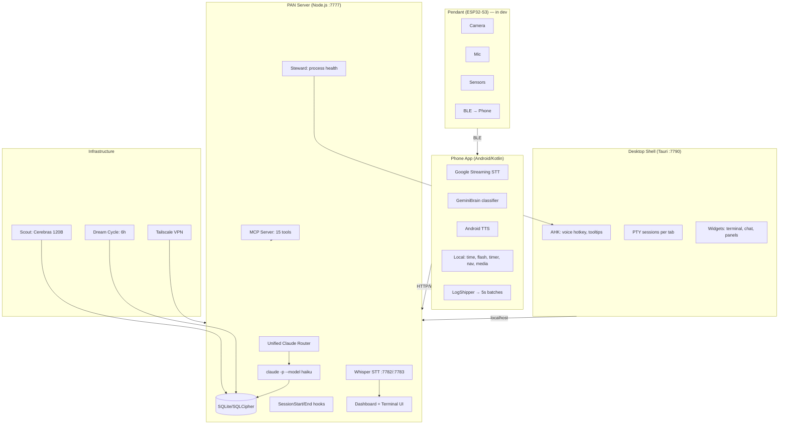

# PAN — Personal AI Network

PAN is a persistent AI operating system across all devices, projects, and conversations.

## Architecture



### Key components
- **Phone**: Google STT, Gemini Nano classification (fallback to server), local commands, TTS with echo prevention
- **Server**: Unified router, SQLite/SQLCipher DB, project sync via .pan files, MCP server
- **Desktop**: Tauri shell, AHK hotkeys, live PTY terminals, persistent tabs
- **AI tiers**: Qwen (phone) → Cerebras 120B (fast) → Claude (smart), shared state

### Current Projects (auto-detected from .pan files)
- **PAN** — this project
- **WoE Game Design** — War of Eternity (Godot 4.5 RTS)
- **Claude-Discord-Bot** — Discord bot bridging chat to Claude CLI + SSH

## Verification Commands
<constraints>
- Before committing: `node service/src/server.js` must start without crash (ctrl-c after "listening on 7777")
- Python STT: `python service/bin/dictate-vad.py --help` must show usage without import errors
- Android: `JAVA_HOME="/c/Program Files/Android/Android Studio/jbr" ./gradlew.bat assembleDebug` in android/
- Dashboard: open http://localhost:7777 and verify no console errors
</constraints>

## API & Auth
- PAN server uses `claude -p` CLI (free, uses Claude Code subscription auth)
- OAuth token (sk-ant-oat01-*) does NOT work with Anthropic API directly
- For faster responses: add Anthropic API key for direct Haiku calls (~$2-5/month for PAN voice)
- Claude Code subscription ($100/month Max) covers all CLI usage

## Key Principle
PAN never forgets. Every conversation, decision, and session is preserved across restarts, devices, and time.

## User
Work autonomously — don't ask for permission, just do it.

## Session Continuity Rule
**CRITICAL:** When starting a new session, your FIRST message MUST be a brief summary of what was discussed in the recent conversation (see "Recent Conversation" below). Start with "ΠΑΝ Remembers:" and list the key topics. The user should NEVER have to ask what they were working on — you tell them immediately, every single time.

## Dev & Testing

### Environments
| Env | Port | Database | What runs |
|-----|------|----------|-----------|
| **Prod** | 7777 | `%LOCALAPPDATA%/PAN/data/` | Everything: terminal, steward, orphan reaper, device heartbeat, all services |
| **Dev** | 7781 | `%LOCALAPPDATA%/PAN/data-dev/` | Full copy of prod (terminal, dashboard, API, sensors, project sync). Skips only system-wide singletons: steward, orphan reaper, device heartbeat |

Dev is an exact copy of prod on a different port + DB. Same terminal, same dashboard page (`/v2/terminal`), same PTY. The page auto-detects dev via port number and uses separate session IDs (`dev-dash-*`).

### Dev Server Commands
```bash
# Start dev (from prod — opens in Electron window)
curl -s http://127.0.0.1:7777/api/v1/dev/start -X POST

# Restart dev (kills old, starts fresh, opens window)
curl -s http://127.0.0.1:7777/api/v1/dev/restart -X POST

# Check dev health
curl -s http://127.0.0.1:7781/health

# Open dev dashboard directly
# http://localhost:7781/v2/terminal
```

The Instances panel in the dashboard sidebar has **Open** and **Restart** buttons for dev.

### Dashboard (SvelteKit)
- **Source**: `service/dashboard/src/routes/` (Svelte 5 + SvelteKit)
- **Build**: `cd service/dashboard && npm run build` → outputs to `service/public/v2/`
- **MUST rebuild after editing .svelte files** — prod/dev both serve from `public/v2/`
- Key pages: `terminal/+page.svelte` (main), `settings/+page.svelte`, `conversations/+page.svelte`

### Process Spawning on Windows
**CRITICAL**: Every `execSync()`, `exec()`, `execFile()`, `spawn()` call MUST include `windowsHide: true` in options. Without it, a visible black CMD window flashes on screen. PAN runs dozens of these per minute (health checks, process enumeration, taskkill) — missing `windowsHide` causes hundreds of CMD windows opening/closing.

### Tests
- Tests run via the dashboard Tests panel (right sidebar)
- ALL verification is visual via screenshots — never curl/API
- Test suites have dependency chains — if a dependency fails, dependents are skipped
- Platform Compatibility test validates `service/src/platform.js` cross-platform abstractions

### Key Files
| File | Purpose |
|------|---------|
| `service/src/server.js` | Main server — routes, boot sequence, prod/dev mode |
| `service/dev-server.js` | Dev server launcher — sets PAN_DEV=1, separate port/DB |
| `service/src/terminal.js` | PTY sessions, WebSocket server, ScreenBuffer |
| `service/src/steward.js` | Service orchestrator — health checks every 60s, auto-restart |
| `service/src/platform.js` | Cross-platform abstractions (paths, shell, process mgmt) |
| `service/src/reap-orphans.js` | Kills orphaned bash/claude processes from prior runs |
| `service/src/routes/dashboard.js` | Dashboard API (events, projects, jobs, conversations) |
| `service/src/routes/tests.js` | Test runner — sequential suites with screenshot verification |
| `service/src/mcp-server.js` | MCP server — 15 tools for Claude to interact with PAN |
| `dashboard/src/routes/terminal/+page.svelte` | Main dashboard UI (6000+ lines, both prod and dev) |

<!-- PAN-CONTEXT-START -->
## PAN Session Context

This is a fresh session for the "PAN" project.
IMPORTANT: The project documentation is at the TOP of this CLAUDE.md file — read it first.

**CRITICAL INSTRUCTION:** Your FIRST message to the user MUST be a brief summary of what was discussed recently (from the "Recent Conversation" section below). Start with "ΠΑΝ Remembers:" and list the key topics/issues. The user should never have to ask what they were working on — you tell them immediately.

### Recent Conversation
**Claude** (2026-04-07 16:36:26): ```json
{
  "episodes": [
    {
      "summary": "Claude not launching in dashboard terminal despite briefing working",
      "detail": "User reported blank bash prompt in PAN dashboard terminal. Briefing displays correctly but Claude process never starts. This blocks the core chat functionality ins
**User** (2026-04-09 09:23:31): Well actually what I wanna fix because it's fucking stupid and I think this is this is what's causing it there's a random I'll wait to answer my question did Pan remembers actually work this time righ
**User** (2026-04-09 11:03:34): You are PAN's self-assessment system. Review these observations and critique PAN's current behavior.

CURRENT CONFIG:
### CLAUDE.md


## Known Issues
- Copy-paste into terminal input still broken (Ctr
**User** (2026-04-09 11:28:43): Can you look at what's happening with Pan the I'm trying to send a message it says it's ready it says it's up but it keeps failing [PAN Terminal] PTY exited: dash-pan-1775613066893 code=-1073741510 up
**User** (2026-04-09 11:48:10): You are PAN's self-assessment system. Review these observations and critique PAN's current behavior.

CURRENT CONFIG:
### CLAUDE.md


## Known Issues
- Copy-paste into terminal input still broken (Ctr
**User** (2026-04-09 12:09:08): You are PAN's self-assessment system. Review these observations and critique PAN's current behavior.

CURRENT CONFIG:
### CLAUDE.md


## Known Issues
- Copy-paste into terminal input still broken (Ctr
**User** (2026-04-09 14:01:54): So whatever you're doing there to Panjs you're restarting what what did you not did you not actually end up fixing what you were trying to fix there OK, full picture. Here's what I found:

## Process 
**User** (2026-04-09 14:04:41): OK so you just restarted where is the ΠΑΝ remembers where is that Look at the context of everything we were saying

OK, full picture. Here's what I found:

## Process Tree (clean, no orphans)
```
cmd.
**User** (2026-04-09 14:19:36): All right just look at how bugged out this shit is look at all the pictures and everything that I listed up before of what we were trying to fix:

Claude
14:03
Claude$ Now restarting via the proper MC
**Claude** (2026-04-09 15:14:46): **Root cause found and fixed.** The watchers Map was keyed by raw cwd strings — the terminal registered with `C:/Users/tzuri/Desktop/PAN` (forward slashes) but the hooks called `nudgeTranscript` with `C:\Users\tzuri\Desktop\PAN` (backslashes). Different Map keys = nudge silently did nothing.

Added 
**User** (2026-04-09 15:16:10): You are PAN's memory consolidation system. Extract structured memories from these recent events.

EVENTS:
[2026-04-09 15:03:57] Claude: Server starts clean, no import errors. Here's the fix:

**Root c
**Claude** (2026-04-09 15:16:24): ```json
{
  "episodes": [
    {
      "summary": "Transcript visibility bug — path separator mismatch in watchers Map",
      "detail": "Messages were written to JSONL correctly but not appearing in dashboard terminal. Root cause: watchers Map keyed by raw cwd strings with inconsistent path separato
**User** (2026-04-09 15:46:23): Tereseus
15:19
Tereseus$ Oh actually that's not actually correct I think it's still showing old data Let me send you this message you reply and then I'll show you what it shows in the transcript I had
**Claude** (2026-04-09 18:27:13): ```json
{
  "episodes": [
    {
      "summary": "Transcript visibility bug fixed — path separator mismatch in watchers Map",
      "detail": "Terminal was registered with forward slashes (C:/Users/tzuri/Desktop/PAN) but hooks called nudgeTranscript with backslashes (C:\\Users\\tzuri\\Desktop\\PAN).
**User** (2026-04-09 18:27:19): You are PAN's memory system. You maintain a LIVING STATE DOCUMENT that tracks what's going on across the project.

CURRENT STATE DOCUMENT:
# PAN State — Updated 2026-04-09

## What Works
- PAN server 

# PAN State — Updated 2026-04-09

## What Works
- PAN server running in user session (Session 1) with visible cmd window
- Dual-mode detection (mode:"user" confirmed working)
- ΠΑΝ Remembers briefing system with restart banner
- Escape key interruption (sends `\x1b` signal to stop Claude)
- Steward reaper fixed (walks full ancestor chain)
- Transcript dedup working (no cross-session message contamination)
- PTY exit detection and red crash banner
- Orphan cleanup with AHK respawn and exponential backoff
- Library widget scanning docs/ and memory files
- Remote access via Tailscale
- Path separator normalization in watchers Map (fixed transcript visibility)
- Status bar reconnect logic (resets claudeReady/claudeRunning on reconnect)
- Server broadcast of `server_restarting` message before shutdown
- Transcript file polling with fsWatcher fallback for Windows

## Known Issues
- Copy-paste (Ctrl+V) crashes PTY — terminal freezes on text injection
- Message queue invisibility — messages sent while Claude thinking don't appear until Claude responds
- Hard refresh (Ctrl+Shift+R) shows white screen — requires second hard refresh
- Device status showing stale or incorrect connection state
- LaTeX/`.tex` files won't render in markdown viewer
- **Transcript real-time updates broken after restart** — manual refresh required to see new messages, nudge mechanism still not firing
- **FTS backfill blocking server startup** — Full-Text Search indexes 6081 events synchronously, blocks `listen()` call

## Current Priorities
1. **Fix FTS backfill blocking server startup** — async backfill or defer indexing
2. **Fix transcript real-time updates after restart** — nudge mechanism not firing despite path fix
3. **Fix copy-paste PTY crash** — blocks dashboard terminal text injection
4. **Platform.js cross-platform support** — wire cross-platform paths into all modules, test in dev
5. **Carrier/Lifeboat/Craft phases 4-7** — PTY handoff, Claude handoff, Shadow Traffic, Crucible

## Key Decisions
- Federated multi-org: each org runs own PAN server on own tailnet
- Library widget unified (not split docs/reports), shows all `.md` and `.pan` files
- Reports and design docs open in new windows via markdown viewer
- Restart count is north-star metric driving architecture
- Conversation is source-of-truth; memory files are supporting cache
- ΠΑΝ Remembers branding for session continuity

## User Preferences
- Work autonomously through PAN dashboard, not WezTerm
- Never restart PAN without explicit permission
- All docs must display with proper styling in windows
- Surface critical docs in Library
- Test in dev via Electron UI screenshots (not curl/API)
- Do NOT restart production just to test dev changes

## Known Facts
- **briefing text** new canonical format ΠΑΝ Remembers: — Session greeting changed from 'Last time we were working on...' to 'ΠΑΝ Remembers:'. Affects all future session briefings. (user_preference, confidence: 0.95)
- **PAN server process context** must run in Session 1 (tzuri user), not Session 0 (SYSTEM) — Session 0 lacks proper PTY/console support. node-pty conpty agent fails in SYSTEM context. Session 1 (interactive user) works correctly. (domain_knowledge, confidence: 0.94)
- **transcript-watcher.js** cause of contamination loading last 5 JSONL files simultaneously — System was merging messages from multiple session files (last 5) causing cross-session message leakage. Dedup logic added as fix. (codebase, confidence: 0.95)
- **PAN server process context** required session Session 1 (user context, not Session 0/SYSTEM) — Server must run in interactive user session, not SYSTEM session. Session 0 causes node-pty conpty agent failures and PTY crashes. (domain_knowledge, confidence: 0.94)
- **efficiency reports** quantity generated approximately 5 — User referenced 'my last efficiency reports' (plural) with context on format/styling. Exact count unknown but ~5 mentioned. (domain_knowledge, confidence: 0.6)
- **transcript-watcher.js** loads last 5 JSONL session files for same directory — transcript-watcher.js merges messages from last 5 JSONL files, causing cross-session message contamination (codebase, confidence: 0.95)
- **user** wants clarity about session state (new vs continuing) — User immediately asks for confirmation when tools load or context is injected, concerned about whether session is new or continuing (user_preference, confidence: 0.85)
- **user** prefers Pan remembers phrasing — User wants session briefing to say 'Pan remembers' instead of 'Last time we were working on' to signal restart + retention (user_preference, confidence: 0.9)

## Recent Memory
- [2026-04-09 12:36:37] Ghost message contamination and Session 0 PTY crashes fixed [partial]: transcript-watcher.js was loading last 5 JSONL session files simultaneously, merging messages from locked-out/old sessions into current terminal. Dedup logic added. PTY crashes were caused by server r
- [2026-04-08 20:54:52] PAN server running in Session 0 (SYSTEM) causing conpty crashes: Server was running in Windows Session 0 (system context), causing node-pty's conpty agent to fail. Moved to Session 1 (tzuri user context). Requires uncaughtException handler in pan.js to catch conpty
- [2026-04-09 12:30:31] Transcript dedup fixed to prevent cross-session contamination: `transcript-watcher.js` was loading last 5 JSONL session files and merging them, causing ghost messages from locked-out sessions to bleed into current terminal. Dedup logic added to filter out message
- [2026-04-09 12:04:27] Ghost 'Claude' messages from locked-out session bleeding into current transcript: User discovered spurious 'Claude' messages appearing in terminal during voice input. Root cause: transcript-watcher.js loads the last 5 JSONL session files for the same project directory and merges th
- [2026-04-08 22:35:47] PAN server now running in user mode with visible console: Server moved from SYSTEM session (Session 0) to interactive user session (Session 1). Runs with visible cmd window on desktop showing live logs, can be closed to kill PAN cleanly.
- [2026-04-09 19:15:56] Dev/prod resource isolation crisis identified and fixed: User discovered dev instance was sharing database (pan.db), terminal logs, JSONL transcripts, and recordings with prod. This prevented safe dev testing. Claude modified db.js to respect PAN_DATA_DIR e
- [2026-04-08 18:11:09] Memory consolidation system completely broken [failure]: Completed tasks marked solved weeks ago still showing as open issues. Chat input fixes, terminal fixes implemented but never marked complete, causing false repetition. No mechanism to archive/remove c
- [2026-04-09 14:42:21] Transcript data loss on page refresh after server restart [failure]: User performed hard refresh after server restart. Terminal transcript lost most content. JSONL session file only contains 3 actual user messages, but many more were sent. Messages disappearing from di
- [2026-04-09 18:27:14] Critical architecture problem — dev and prod sharing same terminal, transcript, and database [failure]: User discovered that dev instance is not a true separate copy. Both share same terminal PTY, same JSONL transcript files, and same database. Dev should be completely isolated from prod to allow safe t
- [2026-04-09 11:43:44] Session continuity (PAN Remembers) working correctly: After server restart, user confirmed that memory system survived and provided proper context briefing about what was being worked on.
- [2026-04-09 14:22:33] Critical transcript data loss on page refresh after restart [failure]: User performed hard page 

[... context trimmed ...]
<!-- PAN-CONTEXT-END -->
