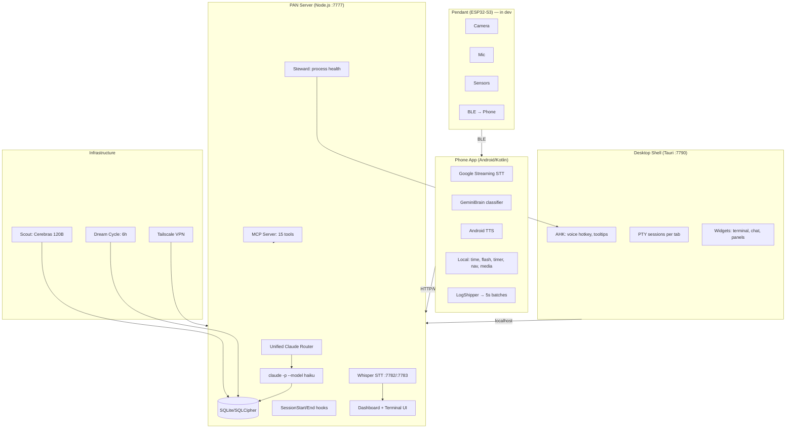

# PAN — Personal AI Network

PAN is a persistent AI operating system across all devices, projects, and conversations.

## Architecture



### Key components
- **Phone**: Google STT, Gemini Nano classification (fallback to server), local commands, TTS with echo prevention
- **Server**: Unified router, SQLite/SQLCipher DB, project sync via .pan files, MCP server
- **Desktop**: Tauri shell, AHK hotkeys, live PTY terminals, persistent tabs
- **AI tiers**: Qwen (phone) → Cerebras 120B (fast) → Claude (smart), shared state

### Current Projects (auto-detected from .pan files)
- **PAN** — this project
- **WoE Game Design** — War of Eternity (Godot 4.5 RTS)
- **Claude-Discord-Bot** — Discord bot bridging chat to Claude CLI + SSH

## Verification Commands
<constraints>
- Before committing: `node service/src/server.js` must start without crash (ctrl-c after "listening on 7777")
- Python STT: `python service/bin/dictate-vad.py --help` must show usage without import errors
- Android: `JAVA_HOME="/c/Program Files/Android/Android Studio/jbr" ./gradlew.bat assembleDebug` in android/
- Dashboard: open http://localhost:7777 and verify no console errors
</constraints>

## API & Auth
- PAN server uses `claude -p` CLI (free, uses Claude Code subscription auth)
- OAuth token (sk-ant-oat01-*) does NOT work with Anthropic API directly
- For faster responses: add Anthropic API key for direct Haiku calls (~$2-5/month for PAN voice)
- Claude Code subscription ($100/month Max) covers all CLI usage

## Key Principle
PAN never forgets. Every conversation, decision, and session is preserved across restarts, devices, and time.

## User
Work autonomously — don't ask for permission, just do it.

## Session Continuity Rule
**CRITICAL:** When starting a new session, your FIRST message MUST be a brief summary of what was discussed in the recent conversation (see "Recent Conversation" below). Start with "ΠΑΝ Remembers:" and list the key topics. The user should NEVER have to ask what they were working on — you tell them immediately, every single time.

<!-- PAN-CONTEXT-START -->
## PAN Session Context

This is a fresh session for the "PAN" project.
IMPORTANT: The project documentation is at the TOP of this CLAUDE.md file — read it first.

**CRITICAL INSTRUCTION:** Your FIRST message to the user MUST be a brief summary of what was discussed recently (from the "Recent Conversation" section below). Start with "ΠΑΝ Remembers:" and list the key topics/issues. The user should never have to ask what they were working on — you tell them immediately.

### Recent Conversation
**Claude** (2026-04-05 12:29:02): Killed. Now double-click `Voice.ahk` on your Desktop, or type `! start "" "C:/Users/tzuri/Desktop/PAN/service/bin/AutoHotkey64.exe" "C:/Users/tzuri/Desktop/Voice.ahk"` in this terminal.
**User** (2026-04-05 14:15:59): <task-notification>
<task-id>bgpk4iskl</task-id>
<tool-use-id>toolu_01JZCisyxjbCh3kemF8C2V1V</tool-use-id>
<output-file>C:\WINDOWS\TEMP\claude\C--Users-tzuri-Desktop-PAN\5ba81714-3221-4087-a880-27118e
**User** (2026-04-06 12:36:30): your last git merge also caused this problem

❯ pan dashboard is not loading just a black page

● Let me check the server and dashboard status.

● Bash(powershell -Command "Get-Process | Where-Object 
**User** (2026-04-06 12:37:09): ❯ pan dashboard is not loading just a black page

● Let me check the server and dashboard status.

● Bash(powershell -Command "Get-Process | Where-Object { \$_.ProcessName -match 'node|electron|pan' }
**User** (2026-04-07 15:54:28): OK so now I can talk to Claude they are there I don't understand what is going on Let me just send you everything just in case something weird is happening I want you to I want you to read it  Tereseu
**Claude** (2026-04-07 15:57:30): Yes — totally different sessions. To be precise:

**This conversation (me, in WezTerm):**
- Started by you directly in WezTerm
- cwd: `C:\Users\tzuri\OneDrive\Desktop\PAN`
- Writes to: `~/.claude/projects/C--Users-tzuri-OneDrive-Desktop-PAN/<my-session-id>.jsonl`

**PAN dashboard's terminal tab:**
-
**Claude** (2026-04-07 16:36:26): ```json
{
  "episodes": [
    {
      "summary": "Claude not launching in dashboard terminal despite briefing working",
      "detail": "User reported blank bash prompt in PAN dashboard terminal. Briefing displays correctly but Claude process never starts. This blocks the core chat functionality ins
**User** (2026-04-09 09:23:31): Well actually what I wanna fix because it's fucking stupid and I think this is this is what's causing it there's a random I'll wait to answer my question did Pan remembers actually work this time righ
**User** (2026-04-09 11:03:34): You are PAN's self-assessment system. Review these observations and critique PAN's current behavior.

CURRENT CONFIG:
### CLAUDE.md


## Known Issues
- Copy-paste into terminal input still broken (Ctr
**User** (2026-04-09 11:28:43): Can you look at what's happening with Pan the I'm trying to send a message it says it's ready it says it's up but it keeps failing [PAN Terminal] PTY exited: dash-pan-1775613066893 code=-1073741510 up
**User** (2026-04-09 11:48:10): You are PAN's self-assessment system. Review these observations and critique PAN's current behavior.

CURRENT CONFIG:
### CLAUDE.md


## Known Issues
- Copy-paste into terminal input still broken (Ctr
**User** (2026-04-09 12:09:08): You are PAN's self-assessment system. Review these observations and critique PAN's current behavior.

CURRENT CONFIG:
### CLAUDE.md


## Known Issues
- Copy-paste into terminal input still broken (Ctr
**User** (2026-04-09 14:01:54): So whatever you're doing there to Panjs you're restarting what what did you not did you not actually end up fixing what you were trying to fix there OK, full picture. Here's what I found:

## Process 
**User** (2026-04-09 14:04:41): OK so you just restarted where is the ΠΑΝ remembers where is that Look at the context of everything we were saying

OK, full picture. Here's what I found:

## Process Tree (clean, no orphans)
```
cmd.
**User** (2026-04-09 14:19:36): All right just look at how bugged out this shit is look at all the pictures and everything that I listed up before of what we were trying to fix:

Claude
14:03
Claude$ Now restarting via the proper MC

# PAN State — Updated 2026-04-09

## What Works
- PAN server running in user session (Session 1) with visible cmd window and respawn loop
- Dual-mode detection verified — `/health` reports mode:"user", all user features enabled
- Voice hotkey migration to Tauri complete — XButton1 (Win+H) and XButton2 (Whisper) both functional
- ΠΑΝ Remembers briefing system with restart banner — displays on new session start
- Escape key interruption — now sends proper `\x1b` signal to stop Claude thinking
- Steward reaper fixed — walks full ancestor chain, won't kill legitimate Claude processes
- Transcript dedup — ghost messages from locked-out sessions no longer bleed into current transcript
- PTY exit detection and red crash banner
- Orphan cleanup and AHK respawn with exponential backoff
- Library widget endpoint scanning docs/ and memory files recursively
- Remote access via Tailscale

## Known Issues
- Copy-paste (Ctrl+V) crashes PTY — terminal freezes on text injection
- Message queue invisibility — messages sent while Claude thinking don't appear in transcript until Claude responds
- Hard refresh (Ctrl+Shift+R) shows white screen — requires second hard refresh
- Device status showing stale or incorrect connection state
- LaTeX/`.tex` files won't render in markdown viewer

## Current Priorities
1. **Carrier/Lifeboat/Craft phases 4-7** — PTY handoff, Claude handoff, Shadow Traffic, Crucible (phases 1-3 done)
2. **Fix copy-paste PTY crash** — blocks dashboard terminal text injection
3. **Solve message queue visibility during tool execution** — messages must appear immediately
4. **Locate and rebuild efficiency reports** — format: 15,000-20,000% multiplier comparisons

## Key Decisions
- Federated multi-org: each org runs own PAN server on own tailnet
- Library widget unified (not split docs/reports), shows all `.md` and `.pan` files
- Reports and design docs open in new windows via markdown viewer (not terminal)
- Restart count is north-star metric driving architecture (Carrier/Lifeboat/Craft)
- Conversation is source-of-truth; memory files are supporting cache
- ΠΑΝ Remembers branding for session continuity system

## User Preferences
- Work autonomously through PAN dashboard, not WezTerm terminal
- Never restart PAN without explicit permission (cmd window is visible kill switch)
- All docs must display with proper styling/formatting in windows
- Surface critical docs prominently in Library
- Capitalize all UI labels and titles
- Don't spam "claude" or any random text into the terminal

## Known Facts
- **briefing text** new canonical format ΠΑΝ Remembers: — Session greeting changed from 'Last time we were working on...' to 'ΠΑΝ Remembers:'. Affects all future session briefings. (user_preference, confidence: 0.95)
- **PAN server process context** must run in Session 1 (tzuri user), not Session 0 (SYSTEM) — Session 0 lacks proper PTY/console support. node-pty conpty agent fails in SYSTEM context. Session 1 (interactive user) works correctly. (domain_knowledge, confidence: 0.94)
- **transcript-watcher.js** cause of contamination loading last 5 JSONL files simultaneously — System was merging messages from multiple session files (last 5) causing cross-session message leakage. Dedup logic added as fix. (codebase, confidence: 0.95)
- **PAN server process context** required session Session 1 (user context, not Session 0/SYSTEM) — Server must run in interactive user session, not SYSTEM session. Session 0 causes node-pty conpty agent failures and PTY crashes. (domain_knowledge, confidence: 0.94)
- **efficiency reports** quantity generated approximately 5 — User referenced 'my last efficiency reports' (plural) with context on format/styling. Exact count unknown but ~5 mentioned. (domain_knowledge, confidence: 0.6)
- **transcript-watcher.js** loads last 5 JSONL session files for same directory — transcript-watcher.js merges messages from last 5 JSONL files, causing cross-session message contamination (codebase, confidence: 0.95)
- **user** wants clarity about session state (new vs continuing) — User immediately asks for confirmation when tools load or context is injected, concerned about whether session is new or continuing (user_preference, confidence: 0.85)
- **user** prefers Pan remembers phrasing — User wants session briefing to say 'Pan remembers' instead of 'Last time we were working on' to signal restart + retention (user_preference, confidence: 0.9)

## Recent Memory
- [2026-04-09 12:36:37] Ghost message contamination and Session 0 PTY crashes fixed [partial]: transcript-watcher.js was loading last 5 JSONL session files simultaneously, merging messages from locked-out/old sessions into current terminal. Dedup logic added. PTY crashes were caused by server r
- [2026-04-08 20:54:52] PAN server running in Session 0 (SYSTEM) causing conpty crashes: Server was running in Windows Session 0 (system context), causing node-pty's conpty agent to fail. Moved to Session 1 (tzuri user context). Requires uncaughtException handler in pan.js to catch conpty
- [2026-04-09 12:30:31] Transcript dedup fixed to prevent cross-session contamination: `transcript-watcher.js` was loading last 5 JSONL session files and merging them, causing ghost messages from locked-out sessions to bleed into current terminal. Dedup logic added to filter out message
- [2026-04-09 12:04:27] Ghost 'Claude' messages from locked-out session bleeding into current transcript: User discovered spurious 'Claude' messages appearing in terminal during voice input. Root cause: transcript-watcher.js loads the last 5 JSONL session files for the same project directory and merges th
- [2026-04-08 22:35:47] PAN server now running in user mode with visible console: Server moved from SYSTEM session (Session 0) to interactive user session (Session 1). Runs with visible cmd window on desktop showing live logs, can be closed to kill PAN cleanly.
- [2026-04-09 14:42:21] Transcript data loss on page refresh after server restart [failure]: User performed hard refresh after server restart. Terminal transcript lost most content. JSONL session file only contains 3 actual user messages, but many more were sent. Messages disappearing from di
- [2026-04-08 18:11:09] Memory consolidation system completely broken [failure]: Completed tasks marked solved weeks ago still showing as open issues. Chat input fixes, terminal fixes implemented but never marked complete, causing false repetition. No mechanism to archive/remove c
- [2026-04-09 14:22:33] Critical transcript data loss on page refresh after restart [failure]: User performed hard page refresh (via dashboard button) to restart PAN after Claude's build. Upon reconnection, entire terminal transcript lost all content - messages sent during session, screenshots 
- [2026-04-09 11:43:44] Session continuity (PAN Remembers) working correctly: After server restart, user confirmed that memory system survived and provided proper context briefing about what was being worked on.
- [2026-04-09 12:09:33] User requested full Carrier/Lifeboat/Craft plan visibility [partial]: User asked to see 'the whole plan and where we are now' for the 7-phase hot-restart architecture. High-priority context request to review multi-phase system design.
- [2026-04-09 13:52:43] Transcript file content doesn't match terminal display [failure]: User discovered critical mismatch: JSONL session file content differs from what's shown in the terminal. Messages are being written to disk but not appearing in terminal view, or vice versa. Restart m
- [2026-04-09 12:58:06] Sent message missing from transcript after restart [failure]: User reported test message sent during session is not showing up in the transcript. Both chat input and transcript render read from the same session file, so the issue is either: (1) message not writt
- [2026-04-09 

[... context trimmed ...]
<!-- PAN-CONTEXT-END -->
