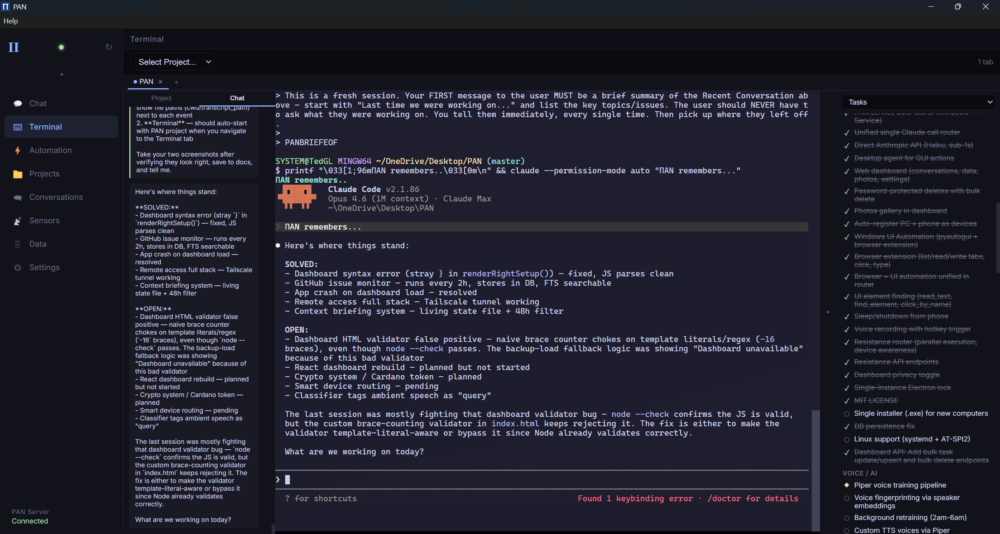
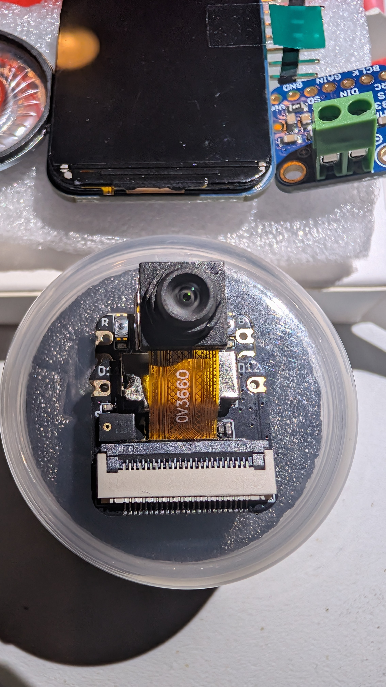
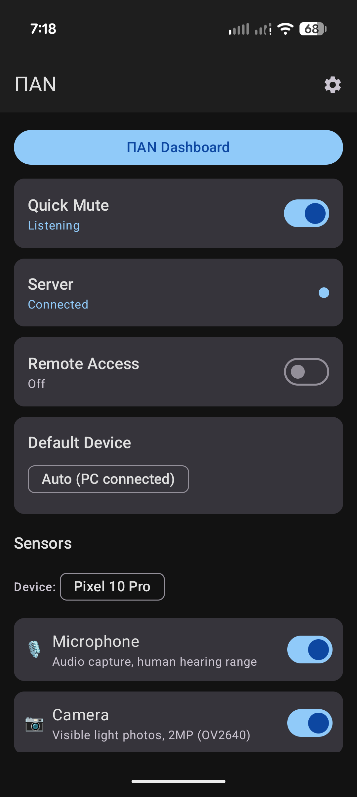
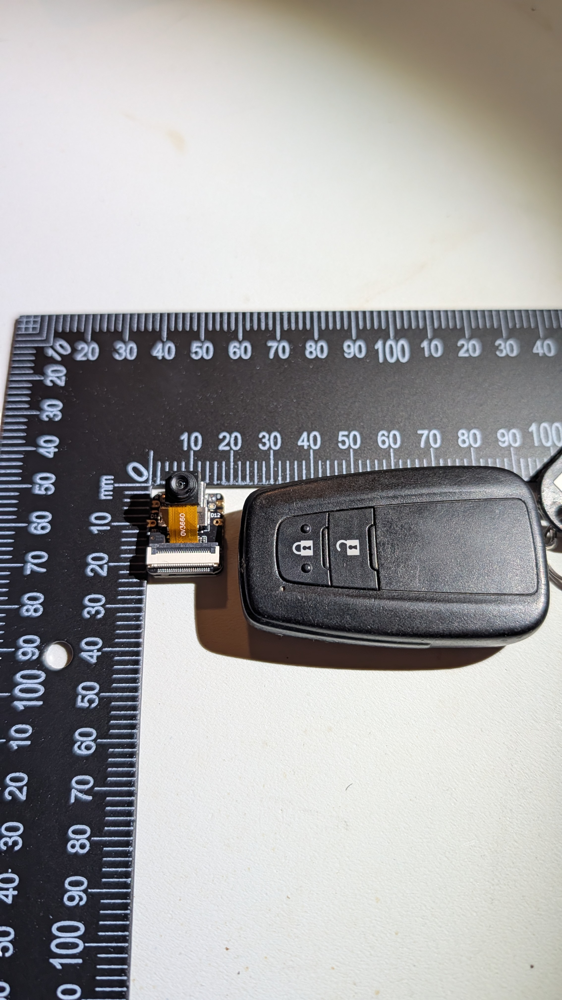
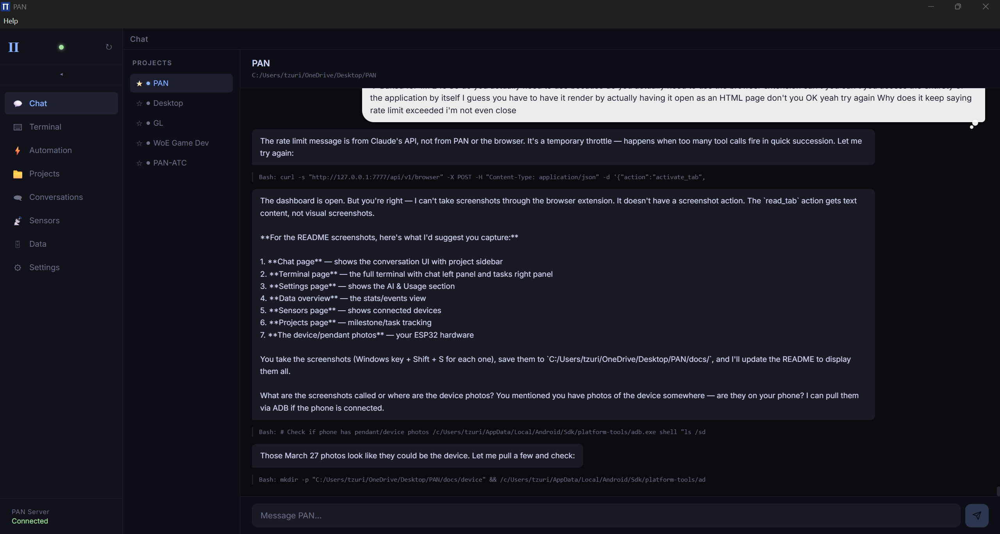
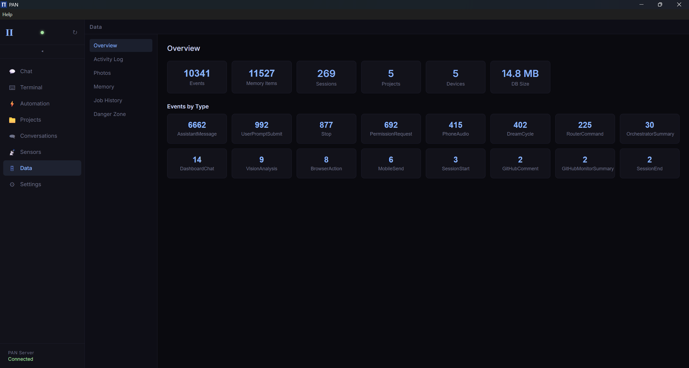
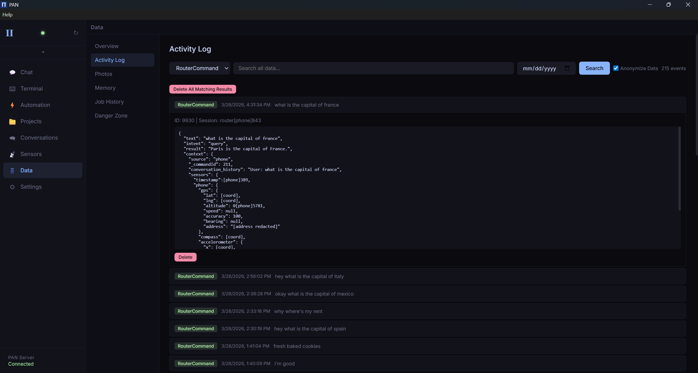
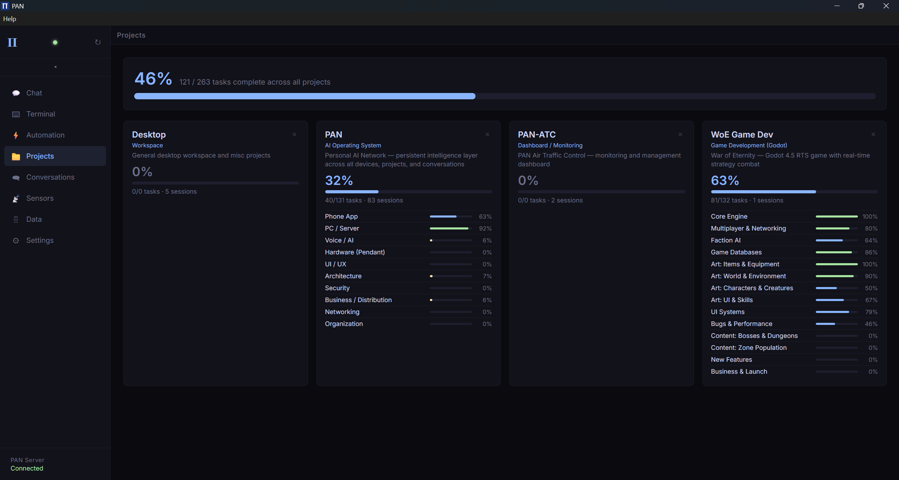
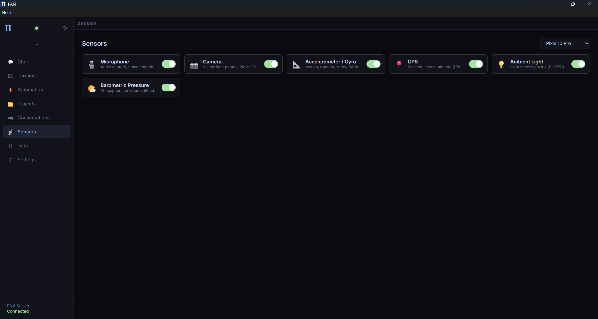
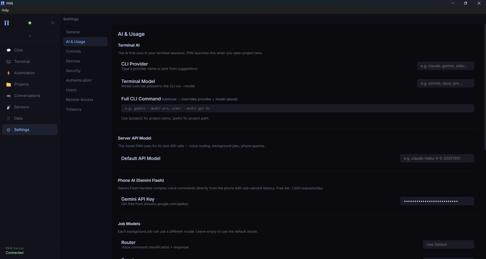

# [ΠΑΝ — Personal AI Network](https://tereseus.github.io/PAN/)

Voice-controlled AI operating system. Phone, computer, browser, wearable pendant — one unified system. Self-hosted, open source, all data on your hardware.

> **[See the interactive demo with screenshots](https://tereseus.github.io/PAN/)**

<p align="center">
  
</p>

<p align="center">
  
  
  
</p>

<p align="center">
  <em>ESP32-S3 camera module (smaller than a car key) — Android app — Size comparison</em>
</p>

| Chat | Data Overview | Activity Log |
|------|---------------|-------------|
|  |  |  |

| Projects | Sensors | Settings |
|----------|---------|----------|
|  |  |  |

---

## What PAN Does

PAN captures, organizes, and protects your personal data across all devices. Voice commands route across phone, PC, browser tabs, and pendant sensors. Always-on microphone with full conversation context.

### Voice Examples

**"What did we say about genies?"**
Searches PAN's database across all conversations — voice, text, terminal — finds the matching conversation in under a second.

**"Show me videogamedunkey's newest video."**
Opens YouTube via browser extension → navigates to channel → plays most recent upload → tells you the title.

**"Is this meat still good?"**
Pendant spectrometer reads chemical composition at the surface — fat oxidation, moisture content. Tells you what a camera can't see.

**"Tell Marcus I'm running late."**
Picks the right messaging app, types the message, sends it.

### Proactive Awareness

PAN learns your patterns and helps before you ask. Every category is independently controllable.

- **Face recognition** — pendant camera identifies people, recalls where you met and what you discussed
- **Conversation capture** — phone numbers, deadlines, promises are automatically saved
- **Context bridging** — connects what you're reading to conversations from last week
- **Safety** — fall detection, emergency contacts, location sharing, duress detection

### Connected PANs

When two people both use PAN, their devices coordinate automatically. Everything is opt-in.

- Silent message queuing when you're busy
- Shared ETAs when heading to the same place
- Emergency detection and automatic contact alerting
- Cross-device memory search with permission

---

## Your Data, Your Control

All data stays on your devices. Not in the cloud, not on anyone else's servers.

- **SQLite database** on your PC (`%LOCALAPPDATA%/PAN/data/pan.db`) — encrypted at rest
- **All communication encrypted** via Tailscale (WireGuard tunnel) — even on local WiFi
- **Data anonymization** — PII stripped before any data leaves your device to cloud AI
- **Delete anything** — single events, entire days, bulk search results, or everything
- **Every action logged** — what PAN heard, how it classified it, what API it called, response time

### Data Dividends

PAN captures your data. You own it. You can sell it.

Three anonymization tiers let you control what you share:
- **Tier 1 (Full Anonymize)** — topics and sentiment only. AI companies buy conversation patterns.
- **Tier 2 (Partial)** — city-level GPS, conversations without names. Urban planning, transit analysis.
- **Tier 3 (Minimal)** — precise GPS, full sensors, conversations with context. Name and personal identifiers always stripped.

Your name, home address, and personal identifiers are permanently removed at every tier. Revenue via crypto staking on Cardano — PAN is free forever, you earn by contributing anonymized data.

---

## Architecture

```
Phone (Android)                    PC (Windows)
├── Google Streaming STT           ├── PAN Service (port 7777)
├── On-device AI (MediaPipe GPU)   ├── Claude Code (via subscription)
├── Gemma 3n (conversation + classify) ├── SvelteKit Dashboard (v2)
├── Camera + Vision                ├── Browser Extension (full DOM control)
├── Tailscale (encrypted tunnel)   ├── Electron Desktop App
├── Voice commands                 ├── SQLite + FTS5 Search
└── BLE ↔ Pendant                  ├── Data Anonymization Layer
                                   ├── Tailscale Auto-Auth
Pendant (ESP32-S3)                 └── Windows Service (auto-start)
├── Camera (OV2640)
├── Microphone
├── Screen (ST7789V)
├── Speaker + Amplifier
└── 22 sensor slots (see below)
```

### Security

- **Tailscale required** for all device communication (raw LAN blocked)
- **Auto-auth** — sign in with Google once, Tailscale connects silently via pre-authorized keys
- **Database encryption** at rest (SQLCipher)
- **Anonymization layer** — emails, phones, GPS, addresses, SSN stripped from all cloud AI calls
- **WireGuard alternative** available for users who prefer self-managed tunnels
- **Headscale** (self-hosted coordination server) planned for enterprise

---

## The Pendant

PAN works with just a phone and computer. The pendant adds first-person perspective.

Size of a Zippo lighter. €155 total cost. 22 sensor slots — use all or just the basics.

| Sensor | What It Does |
|--------|-------------|
| Camera (OV2640) | Identify objects, read signs, translate text |
| Microphone (PDM) | Voice commands, conversation recall |
| Spectrometer (AS7341) | Chemical analysis — food freshness, material ID |
| Thermal Camera (MLX90640) | See heat through walls, detect hot wires |
| Gas Sensor (BME688) | Detect leaks, carbon monoxide, smoke |
| GPS (L76K) | Geotag every event |
| Heart Rate + SpO2 (MAX30102) | Continuous pulse and blood oxygen |
| Accelerometer + Gyro (BMI270) | Fall detection, step counting |
| + 14 more | UV, magnetometer, air quality, color, distance, EMF, radiation... |

Full sensor specifications: [SENSOR-ARRAY.md](SENSOR-ARRAY.md)

**Build it yourself** — full parts list, 3D printable case, assembly guide, firmware. All open source.

---

## Quick Start

### Server (Windows)
```bash
git clone https://github.com/Tereseus/PAN.git
cd PAN/service
npm install
node pan.js start                  # Start the service
node install-service.js            # Auto-start on boot
```

Dashboard opens at `http://localhost:7777/v2/`

### Phone (Android)
1. Build APK from `android/` in Android Studio
2. Install on phone
3. Set server URL → your PC's IP, port 7777
4. Grant microphone + camera permissions
5. Start talking — on-device AI responds in ~5 seconds, server queries in ~7 seconds

### Browser Extension
1. `chrome://extensions/` → Developer Mode → Load unpacked → select `browser-extension/`
2. PAN can now read and control all browser tabs

### Desktop App
```bash
cd service && npx electron electron/main.cjs
```

---

## Tech Stack

| Layer | Technology |
|-------|-----------|
| Phone | Kotlin, Jetpack Compose, MediaPipe GPU, Gemma 3n, Google STT, Hilt DI, Tailscale (tsnet) |
| Server | Node.js, Express, SQLite (better-sqlite3 + SQLCipher), Claude Agent SDK |
| Dashboard | SvelteKit 2, Svelte 5, xterm.js, WebSocket terminals |
| Desktop | Electron, system tray, Windows Service |
| Browser | WebExtension API (Manifest V3) — Chrome, Edge, Brave |
| AI | Claude Code (terminal), Gemma 3n (phone, on-device), MediaPipe (GPU inference) |
| Security | Tailscale (WireGuard), auto-auth keys, data anonymization, SQLCipher |
| Pendant | ESP32-S3, I2C/SPI sensors, BLE 5.0 |
| Voice | Google Streaming STT, Android TTS, Piper (voice clone, in progress) |

## System Requirements

| Component | Minimum | Recommended |
|-----------|---------|-------------|
| CPU | Any i5 (2018+) | i5-10th gen+ |
| RAM | 8 GB | 16 GB |
| Storage | 128 GB SSD | 256 GB+ SSD |
| Network | Always-on internet | Ethernet preferred |
| OS | Windows 10/11 | Windows 11 |
| Phone | Android 12+, 6GB RAM | Pixel 10 Pro or equivalent |
| Cost | ~$150 used PC | ~$200-300 |

At ~1.5 MB/day for text data, 256 GB lasts decades. With pendant photos, ~50-100 MB/day.

---

## Status

### Working
- Voice conversation across phone + PC (on-device + server)
- SvelteKit dashboard with terminal, chat, projects, sensors, data, settings
- Cross-device command routing (phone → PC → browser)
- Remote access via Tailscale with auto-authentication
- On-device AI (Gemma 3n via MediaPipe GPU, ~5s responses)
- FTS5 full-text search across all events and conversations
- Data anonymization (PII stripping before cloud AI calls)
- Project tracking with milestones, tasks, drag-and-drop
- Phone sensor control from dashboard
- Claude Code hooks integration (SessionStart, Stop, UserPromptSubmit)
- Browser extension (read/control tabs, click elements, type text)
- Windows Service (auto-start, auto-restart)
- Dream cycle (consolidates events into structured memory)
- GitHub issue monitoring

### In Progress
- Pendant firmware (ESP32-S3 — camera, BLE, screen driver)
- Voice fingerprinting (Piper training with user audio)
- Data dividend / treasury system (Cardano staking)
- Installer (one-click setup)
- Real-time contextual awareness (proactive conversation jumping)

### Planned
- Headscale (self-hosted coordination for enterprise)
- Cross-user messaging relay
- Duress detection (stress analysis, silent emergency alerts)
- File access across devices via Tailscale (no USB needed)
- OpenRouter integration (Cerebras/Groq, sub-1s responses)

---

*PAN doesn't require any specific AI provider. Use Claude Code, Gemini CLI, Cursor, or any tool — as long as your project has a `.pan` file, PAN captures everything. The AI is pluggable. Your data is not.*

---

**License:** Open Source
**Created by:** [Tereseus](https://github.com/Tereseus)
**Concept:** AI Cyclosis — the recursive loop of AI-driven development
